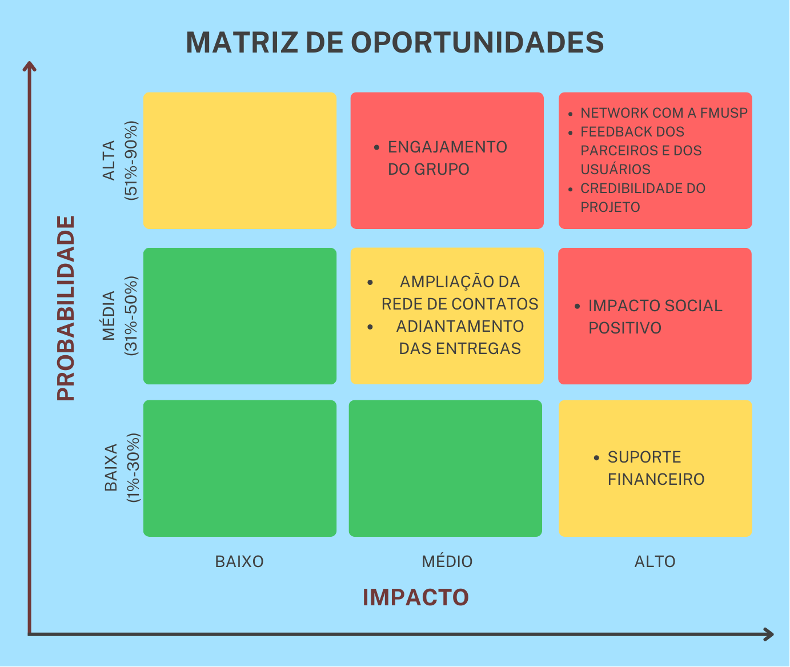

# GDD - Game Design Document - Módulo 1 - Inteli

## Tilápia

#### Gabriel Henrique Martins Alves
#### Gabriel Scarpelin Diniz
#### Isabelly Maia Montalvão
#### Leonardo Casal Andriolo
#### Matheus Jorge Rosa
#### Pietra Pasqualini Batista
#### Rodrigo Natan Erlich


## Sumário

[1. Introdução](#c1)

[2. Visão Geral do Jogo](#c2)

[3. Game Design](#c3)

[4. Desenvolvimento do jogo](#c4)

[5. Casos de Teste](#c5)

[6. Conclusões e trabalhos futuros](#c6)

[7. Referências](#c7)

[Anexos](#c8)

<br>


# <a name="c1"></a>1. Introdução (sprints 1 e 4)

## 1.1. Escopo do Projeto

### 1.1.1. Contexto da indústria (sprints 1 e 4)

A Faculdade de Medicina da USP é uma referência no campo da educação superior, destacando-se no ensino de Medicina no Brasil e na realização de pesquisas de ponta, além de campanhas de conscientização para a população. Competindo com outras instituições renomadas, como UNICAMP, PUC-SP e UNIFESP, a FMUSP se destaca por suas iniciativas inovadoras e seu impacto notável no mercado regional e nacional, especialmente através de suas campanhas e atividades clínicas de alto padrão. Internacionalmente reconhecida, a FMUSP continua a liderar o caminho em pesquisas de vanguarda, abrangendo áreas como cirurgia com células-tronco, desenvolvimento de pele artificial e outras tendências futuras na medicina.

### 1.1.2. Análise SWOT (sprints 1 e 4)

Uma análise SWOT é uma técnica usada para identificar forças, oportunidades, fraquezas e ameaças para a sua empresa ou até para um projeto específico. Apesar de simples, a análise SWOT é uma ferramenta poderosa para identificar oportunidades de melhoria frente à concorrência.


Com a análise SWOT, foi possível observar características importantes, tais como os projetos sociais realizados pela Faculdade de Medicina da USP (FMUSP) e a carência de ferramentas tecnológicas para esses projetos sociais. Associados a esses pontos, destacam-se algumas oportunidades, como o amplo público atendido pela FMUSP e, sobretudo, a crescente digitalização mundial. Nesse contexto, o 'Game' foi desenvolvido com o objetivo de atenuar os pontos fracos, potencializar ainda mais os pontos fortes e aproveitar as oportunidades.

### 1.1.3. Descrição da Solução Desenvolvida (sprints 1 e 4)

A falta de conscientização sobre prevenção, primeiros socorros e informações inadequadas sobre queimaduras, em especial em populações vulneráveis, influi na alta incidência de queimaduras, que se torna uma das maiores causas de lesões traumáticas no mundo.<br>
São registrados cerca de 1 milhão de novos casos anualmente no Brasil, e acredita-se que 90% das queimaduras seriam evitadas com devida educação e conscientização da população. Grande parte das queimaduras registradas ocorrem em ambiente residencial e em atividades de lazer, abrangendo, em maioria, homens de 20 a 39 anos. <br>
O game visa conscientizar a população, em especial as vulneráveis, sobre queimaduras, à medida que fornece informações embasadas para estimular a educação de prevenção de queimaduras, além de auxiliar nos primeiros socorros e desmitificar métodos inapropriados de tratamentos. <br>
O game deverá ser acessado pelos smartphones dos estudantes e poderá ser utilizado durante as campanhas de conscientização promovidas pela Faculdade de Medicina da USP ou quando da preferência do usuário. A solução impulsiona os benefícios já fornecidos pelas campanhas de conscientização através de seu aspecto lúdico e divertido de compartilhar informações e combater desinformações. <br>
O critério de sucesso será a satisfação do jogador durante o processo de conscientização através de um game. Para avaliarmos tal critério, uma pesquisa de satisfação será realizada ao final do game, levando em consideração fatores como diversão, jogabilidade e transmissão de conhecimento.


### 1.1.4. Proposta de Valor (sprints 1 e 4)

A proposta de valor, é a essência do que um produto ou serviço oferece aos clientes e como atende às suas necessidades. Desenvolvida em torno do perfil do cliente e da proposta de valor da empresa, a proposta de valor busca alinhar os ganhos desejados, dores enfrentadas e trabalhos a serem realizados pelos clientes com os benefícios oferecidos, problemas resolvidos e produtos/serviços específicos da empresa. Essa ideia foi apresentada por Alexander Osterwalder e sua equipe em seu livro "Value Proposition Design: How to Create Products and Services Customers Want".


Com base no perfil do cliente analisado através do 'Canva Proposition Value', ao observarmos suas dores, ganhos e necessidades, desenvolvemos uma proposta de solução totalmente gamificada. Essa proposta visa envolver os jovens, proporcionando-lhes um ambiente divertido que cumpra o principal objetivo do projeto: a conscientização. Destacamos, sobretudo, a necessidade de algo versátil e atrativo para o público-alvo, oferecendo uma experiência única e divertida, a fim de disseminar entre diversas pessoas e conscientizar cada vez mais a população.

### 1.1.5. Matriz de Riscos (sprints 1 e 4)

A Matriz de Riscos, também chamada de Matriz de Probabilidade e Impacto, é uma ferramenta utilizada para avaliar qual a probabilidade de um evento acontecer e qual o impacto que ele teria na empresa ou projeto. A matriz é eficiente quando há a necessidade de priorizar os riscos, sejam eles negativos (as ameaças) ou positivos (as oportunidades), ou seja, analisar e visualizar quais riscos merecem mais atenção no momento, auxiliando na criação de planos de ação para prevenir ou potencializar tal risco. 
A fim de gerenciar os riscos do nosso produto, a equipe construiu os gráficos (Imagem xx e Imagem yy) que representam nossas ameaças e oportunidades e, contribuem efetivamente para o planejamento de planos de ação.




\# | Plano de ações:
--- | ---
1 | Atraso nas entregas dos afazeres: Apesar da equipe ser bem organizada com prazos e datas, o atraso nas entregas do backlog tem probabilidade de ocorrência média e impacto também médio. A solução ideal é realizar encontros breves diariamente (daily), para que todos os membros do grupo estejam cientes do andamento das funções individuais e coletivas, evitando sobrecargas e obstáculos desnecessários no desenvolvimento do projeto.
2 | Queda da internet durante o desenvolvimento do projeto: De forma geral, quedas e instabilidades na conexão estão fora do controle da equipe, sendo assim, não há efetivamente o que fazer além de esperar. No entanto, a probabilidade de que isso aconteça é baixa e o impacto seria médio, pois parte do desenvolvimento do projeto não requer uma conexão constante à internet.
3 | Falha no sistema do jogo: Para evitar falhas no sistema, a equipe realizará diversos testes para assegurar que tudo ocorrerá como o planejado. Caso aconteça algum imprevisto ou equívoco da nossa parte, realizaremos uma análise profunda para encontrar a raiz do problema e consertá-la.
4 | Não achar equilíbrio entre diversão e educação: Um dos nossos principais desafios é criar um jogo que conscientize a população, e que, ao mesmo tempo, seja divertido e envolvente. Caso o jogo seja focado na diversão, falharemos na entrega de educação, e vice-versa. Para tentar evitar ao máximo essa problemática, faremos testes com pessoas à nossa volta que sejam do público alvo do jogo para que termos críticas e feedbacks no que melhorar.
5 | O usuário não aprender com o jogo: Como um dos objetivos é a conscientização através do jogo, algumas soluções que a equipe entende como necessária e irá implementar para evitar o risco do usuário não aprender com o jogo são, garantir que o conteúdo educacional seja apresentado de maneira clara e concisa, aplicar o conhecimento adquirido em minigames durante o jogo e, utilizar de efeitos sonoros para indicar que uma ação foi satisfatória ou não. 
6 | Falta de comprometimento do grupo: A equipe está bastante empenhada para que o desenvolvimento do projeto seja o mais agradável possível, por isso essa problemática apresenta baixa probabilidade de ocorrência, no entanto, o impacto que a falta de comprometimento teria é alta e o melhor plano de ação para prevenir isso é a comunicação transparente e amigável entre os membros.
7 | Usuário sem acesso às tecnologias necessárias para jogar: Um dos principais motivos para a criação desse jogo é com o intuito de levar o conhecimento a todos, mas principalmente para aqueles que não tem fácil acesso à educação. Por esse motivo, a acessibilidade é uma prioridade e preocupação para a equipe. Para atingir  o máximo de usuário possível, a equipe tentará de tudo para oferecer o jogo além de mobile, mas que também funcione em uma versão web. Além disso, o jogo poderá ser executado em dispositivos mais antigos e que tenham menos capacidade de processamento. 
8 | Problemas com a trilha sonora: Uma ameaça de probabilidade e impacto baixos, pois se houver qualquer imprevisto com a trilha sonora, isso não irá impactar a mensagem ou a jogabilidade do jogo. O plano de ação é analisar e entender a raiz do problema e efetuar as alterações necessárias, além de realizar diversos testes em dispositivos diferentes.
9 | Erros/Alterações visuais (ex: erros gramaticais): Ainda que a equipe Tilápia seja cuidadosa, é normal que aconteçam erros e alterações visuais durante o desenvolvimento do jogo. Por se tratar de falhas relativamente simples de serem resolvidas, o impacto acaba sendo baixo. A solução mais eficiente para ambos é a atenção redobrada para evitar erros e, no caso das alterações puramente estéticas, para não tirar o foco do que realmente importa.
10 | O usuário não se engaja com o jogo: Por ser um jogo com o intuito educativo, é possível que haja problemas no engajamento do usuário. Para evitar ao máximo essa problemática, a equipe desenvolverá no jogo elementos de recompensa para motivar o usuário, como por exemplo, método de pontuação e vida, quiz e tempos limitados para a realização dos objetivos. Além disso, o jogo fica cada vez mais desafiador à medida que o jogador ganha experiência e familiaridade. 
11 | Sobrecarga em relação à habilidades (ex: membros que sabem programar melhor que outros): A probabilidade de haver uma sobrecarga de funções nos membros que têm mais facilidade e familiaridade com programação é alta, no entanto isso terá um impacto significativo à medida que as responsabilidades ficarão desproporcionais em relação ao resto do grupo. Para esse problema, a solução é misturar o grupo para que todos trabalhem em todas as áreas do projeto, mesmo aqueles que têm dificuldades.
12 | O usuário tem dificuldade em entender a dinâmica e mecânica do jogo: Entender como se joga um jogo é essencial para o sucesso do mesmo e a falha na compreensão pode gerar estresse e desinteresse. Para que isso não aconteça, a jogabilidade deve estar alinhada com nível do usuário e o tutorial deve ser bem informativo e esclarecedor, para que o jogo siga um fluxo divertido e intuitivo.
13 | Concorrência com outros jogos: A concorrência com outros jogos é um risco de probabilidade alta e impacto também alto, visto que poderíamos perder clientes, dito isso, uma solução viável seria desenvolver novas estratégias de marketing para o jogo e garantir atualizações que inovem o produto.

## 1.2. Requisitos do Projeto (sprints 1 e 2)

 Esta seção tem como objetivo fornecer uma visão abrangente e detalhada dos requisitos essenciais que orientarão o desenvolvimento do projeto. Aqui, serão delineadas as funcionalidades, características e restrições fundamentais para garantir a compreensão unificada entre a equipe de desenvolvimento e o cliente.
\# | Requisito do cliente 
--- | ---
1|Ensinar quais são as 3 camadas da pele;
2|Falar sobre a espessura das camadas da pele;
3|Definir os diferentes tipos de queimadura;
4|Dizer por que uma queimadura profunda não dói;
5|O jogo deve ser compatível com mobile;
6|A palheta de cores deve ser da FMUSP e do INTELI;
7|Tempo limitado apenas com a intenção de capacitação, experiência única, 15’;
8|Jogo tem de atrair o interesse dos alunos;
9|Deve ter recompensas, pontuação, recordes;
10|Pode ser expandido para fora das escolas;
11|O jogo não aborda formas de tratamento;
12|Focar na prevenção e no que NÃO fazer;
13|Desmistificação de mitos.

\# | Requisito do grupo 
--- | ---
1 | No jogo deve ser implementado um menu inicial com um botão “inciar”;
2 |O jogo deve conter uma sala de recepção, sala de espera para os pacientes, farmácia com questionário e uma biblioteca com livros para se adquirir conhecimento;
3 |Deve ser adicionado ao jogo um sistema de recompensa tendo como base o tempo de atendimento, os acertos no questionário e a satisfação do cliente;
4 |Adicionar efeitos sonoros, música de fundo por meio do framework phaser; 
5 | deve ter animações que serão feitas com spritesheet;
6 |Irá conter uma arte gráfica pixelada, feita com auxílio do piskel;
7 |Inputs de movimentação com o touch screen de dispositivos mobile
8 |Implementação de movimento vetorial para normalização de velocidade;
9 |Programar mudança de cenas para ter um código funcional do menu;
10 |Adicionar animações ao personagem com spritesheet;
11 |Adicionar tecla de input para interação com outros objetos ou personagens;
12 |Fazer quiz no laboratório com mudança de cenas;
13 |O jogo deve ser rápido, com um tempo de duração de em média 10 minutos;
14 |Terá possibilidade de rejogabilidade;
15 |Adquirir pontos em forma de conhecimento e remédio com estilo mágico para não passar a impressão de ser um remédio verdadeiro;
16 |Ter a logo do Hospital das Clínicas, entre outras referências;
17 |Ter uma grande sala com foco no personagem, utilizando dinâmica de câmeras;
18 |Caixa de diálogo com NPC para instruir o personagem principal sobre quais serão seus próximos passos.


## 1.3. Público-alvo do Projeto (sprint 2)

O nosso jogo é pensado e destinado a adolescentes e jovens adultos que fazem parte de comunidades e regiões carentes com acesso limitado à educação, visto que o objetivo principal do projeto é a conscientização e 90% dos incidentes envolvendo queimaduras são reportados em locais onde a população é leiga. O enfoque em jovens facilita a assimilação de informações e a capacitação da população em curto e longo prazo. 

# <a name="c2"></a>2. Visão Geral do Jogo (sprint 2)

## 2.1. Objetivos do Jogo (sprint 2)

O objetivo de um jogo geralmente é a meta que os jogadores devem alcançar para vencer ou progredir. Pode envolver completar tarefas específicas, resolver quebra-cabeças, derrotar inimigos, acumular pontos, entre outros desafios.

Para o nosso jogo, o objetivo é atender o máximo de pacientes em um tempo determinado passando por um ciclo de estudo e prática. Isso implica que os jogadores devem equilibrar eficiência no atendimento com aprimoramento de habilidades através da aprendizagem.

## 2.2. Características do Jogo (sprint 2)

### 2.2.1. Gênero do Jogo (sprint 2)

O gênero se refere à classificação ou categoria que descreve o estilo e a mecânica de jogo predominantes. Cada gênero tem características específicas que definem como os jogadores interagem com o jogo e o que podem esperar dele em termos de jogabilidade, narrativa e objetivos.

O nosso jogo simula a atuação de um médico na triagem dos pacientes, portanto seu gênero é simulação. Como tal, o jogo oferece uma experiência imersiva e educativa, onde os jogadores podem aprender sobre prevenção de queimaduras e sobre o que deve-se ou não fazer logo após se queimar.

### 2.2.2. Plataforma do Jogo (sprint 2)

A plataforma de um jogo se refere ao ambiente ou sistema no qual o jogo é executado. Isso inclui dispositivos como computadores, consoles de videogame, smartphones, tablets, entre outros, e também o sistema operacional ou plataforma online que suporta a execução do jogo.

O jogo será desenvolvido para dispositivos móveis, como smartphones e tablets, e oferecerá uma experiência acessível e portátil. A interface será otimizada para telas sensíveis ao toque, permitindo aos jogadores interagirem intuitivamente com os elementos do jogo. Além disso, a natureza móvel desses dispositivos permitirá que os jogadores acessem o jogo em qualquer lugar, tornando-o conveniente para ser usado na educação.

A aplicação também poderá ser acessado via web, oferecendo flexibilidade adicional aos jogadores, que poderão jogar diretamente de seus navegadores sem a necessidade de downloads adicionais. Isso tornará o jogo acessível a uma ampla gama de dispositivos, garantindo que mais pessoas possam participar e aprender sobre a importância da prevenção de queimaduras.

### 2.2.3. Número de jogadores (sprint 2)

O número de jogadores de um jogo refere-se à quantidade de participantes que podem jogar simultaneamente ou de forma sequencial. Esse aspecto é fundamental na definição da dinâmica do jogo, determinando se é um jogo para um único jogador, para dois jogadores, ou para múltiplos jogadores. O número de jogadores pode influenciar elementos como competição, colaboração, estratégia e interação social dentro do jogo.

No contexto do nosso jogo sobre prevenção de queimaduras, a opção de um jogador oferecerá uma experiência individualizada e centrada no aprendizado. Isso permitirá um foco maior na absorção de informações e na prática de habilidades específicas, como identificar riscos de queimaduras e tomar decisões preventivas adequadas. Além disso, jogar sozinho pode facilitar a personalização da experiência de acordo com o ritmo e as necessidades individuais do jogador.

### 2.2.4. Títulos semelhantes e inspirações (sprint 2)

Títulos semelhantes e inspirações de um jogo referem-se a outros jogos que compartilham características, temas, mecânicas de jogo ou atmosfera semelhantes com o jogo que está sendo desenvolvido. Ao analisar títulos semelhantes, podemos identificar elementos que foram bem-sucedidos em outros jogos e incorporá-los ao nosso próprio projeto. Já as inspirações nos forneceram uma fonte de criatividade e direção para o desenvolvimento do jogo.

Para a concepção do jogo, foram utilizados os seguites jogos como referência de jogabilidade e design:

* [Overcooked](https://www.team17.com/games/overcooked/)<br>
* [Hospital Questiona](https://metodoquestiona.com.br/)<br>
* [Stardew Valley](https://www.stardewvalley.net/)<br>

### 2.2.5. Tempo estimado de jogo (sprint 5)

*Ex. O jogo pode ser concluído em 3 horas passando por todas as fases.*

*Ex. cada partida dura até 15 minutos*

# <a name="c3"></a>3. Game Design (sprints 2 e 3)

## 3.1. Enredo do Jogo (sprints 2 e 3)

*Descreva o enredo/história do jogo, criando contexto para os personagens (seção 3.2) e o mundo do jogo (seção 3.3). Uma boa história costuma ter um arco narrativo de contexto, conflito e resolução. Utilize etapas sequenciais para descrever esta história.* 

*Caso seu jogo não possua enredo/história (ex. jogo Tetris), mencione os motivos de não existir e como o jogador pode se contextualizar com o ambiente do jogo.*

O jogador encarna o papel de Residente, um jovem médico recentemente formado, prestes a iniciar sua jornada no desafiador mundo da medicina. Ao ingressar na equipe do pronto-socorro de queimaduras, ele é guiado pela experiente Dra. Tina, uma figura respeitada no campo da medicina de emergência.

Inicialmente, o Residente é confrontado com situações desafiadoras e momentos de incerteza, onde sua inexperiência se manifesta de maneira evidente. No entanto, à medida que ele se envolve em diagnósticos, tratamentos de emergência e tomadas de decisão rápidas, ele começa a perceber que sua verdadeira jornada como médico está apenas começando.

Ao longo do jogo, o Residente é confrontado com uma série de desafios que testam suas habilidades técnicas, sua eficiência e sua ética . Ele se encontra diante de pacientes cujas vidas dependem de suas decisões, exigindo coragem e determinação para superar obstáculos e salvar vidas.

À medida que o Residente avança em sua jornada, ele não apenas ganha confiança em suas habilidades clínicas, mas também cresce como profissional. Ele aprende lições importantes sobre a prevenção de queimaduras e o domínio sobre os procedimentos de primeiros socorros.


## 3.2. Personagens (sprints 2 e 3)

### 3.2.1. Controláveis

Personagens controláveis referem-se aqueles avatares que são comandados pelo jogador através de comandos de movimento, ações, combate, dentre outros. O jogo referido neste documento terá apenas um personagem controlável em jogo, porém o jogador poderá selecionar o sexo do protagonista, ou seja, haverá duas opções: O residente médico protagonista masculino e a residente médica protagonista feminina. Não será possível jogar com mais de um personagem controlável no mesmo jogo. O nome do personagem controlável masculino é X e Y, o nome da protagonista feminina. O avatar controlável será um(a) residente médico(a) especializando-se na área de cirurgia plásticas, especialmente em queimaduras. X ou Y é guiado pela Dra. Cristina durante seu expediente, e possui habilidades para atender os pacientes, consultar livros na Biblioteca para adquirir o conhecimento e responder às perguntas no Laboratório para receber o remédio (fictício) necessário para tratar o cliente.

### 3.2.2. Non-Playable Characters (NPC)


Personagens não controláveis (NPCs) são avatares os quais o jogador não possui controle direto, portanto não comandam seus movimentos e ações específicas. Em nosso projeto, haverá vários NPCs, dos quais 6 representarão os pacientes a serem atendidos pelo jogador através do personagem principal e a um será a Dra. Cristina, NPC responsável por guiar o jogador sobre o fluxo de jogabilidade e tutoriais em pontos específicos.

### 3.2.3. Diversidade e Representatividade dos Personagens

Considerando as personagens do game, analise se estas estão alinhadas ao público-alvo do jogo (seção 1.3), e compare-as dentro da realidade da sociedade brasileira. Por fim, discorra sobre qual é o impacto esperado da escolha dessas personagens.

## 3.3. Mundo do jogo (sprints 2 e 3)

### 3.3.1. Locações Principais e/ou Mapas (sprints 2 e 3)

*Descreva o ambiente do jogo, em que locais ele ocorre. Ilustre com imagens. Se houverem mapas, posicione-os aqui, descrevendo as áreas em acordo com o enredo. Se houverem fases, descreva-as também em acordo com o enredo (pode ser um jogo de uma fase só). Utilize listas ou tabelas para organizar esta seção. Caso utilize material de terceiros em licença Creative Commons, não deixe de citar os autores/fontes.*

O jogo se passa em um fase única e cíclica composta pelos seguintes ambientes:

Sala de Triagem: Onde os pacientes chegam ao hospital e são inicialmente avaliados pelo jogador, que no papel do médico residente, avalia a gravidade das queimaduras dos pacientes. 

Consultório: Após a triagem, o paciente se desloca para o consultório, onde aguarda o médico voltar com seu tratamento.

Biblioteca: Um ambiente onde o jogador pode acessar informações sobre prevenção de queimaduras e procedimentos de primeiros socorros de acordo com o paciente que está atendendo.

Laboratório: Onde o jogador aplica os conhecimentos adquiridos para que consiga o remédio (representativo) correto para que consiga tratar o paciente.


### 3.3.2. Navegação pelo mundo (sprints 2 e 3)

*Descreva como os personagens se movem no mundo criado e as relações entre as locações – como as áreas/fases são acessadas ou desbloqueadas, o que é necessário para serem acessadas etc. Utilize listas ou tabelas para organizar esta seção.*

O jogador controla o médico residente, utilizando controles direcionais de dispositivos móveis tocando na tela e arrastando o dedo na direção desejada, possibilitando a movimentação de uma área para outra dentro dos limites do hospital e interagindo com possíveis objetos e pacientes por meio de uma colisão.

No jogo, o acesso às diferentes salas e ambientes é automático e não requer desbloqueio. No entanto, para interagir com objetos e pacientes e acessar certas funcionalidades, existem condições específicas a serem cumpridas.

Na sala de triagem, o jogador pode se mover livremente e deve se aproximar de um paciente para visualizar e avaliar seu prontuário. Após a avaliação, o paciente é transferido automaticamente para o consultório.

A Biblioteca está disponível para o Residente a qualquer momento. Para acessar as informações, basta colidir com uma estante. O conteúdo da Biblioteca permanece o mesmo, independente do paciente sendo atendido.

No laboratório, o Residente deve colidir com um objeto para iniciar um jogo de perguntas. As perguntas variam de acordo com o histórico do paciente, tornando essa funcionalidade disponível apenas após a triagem. Ao responder corretamente, o jogador recebe uma pílula de tratamento.

O Residente retorna ao consultório, onde o paciente o espera, para administrar o tratamento após identificar a medicação correta. Esse procedimento só é possível se o médico tiver triado o paciente corretamente e recebido a medicação após o quiz.


### 3.3.3. Condições climáticas e temporais (sprints 2 e 3)

*\<opcional\> Descreva diferentes condições de clima que podem afetar o mundo e as fases, se aplicável*

*Caso seja relevante, descreva como o tempo passa, se ele é um fator limitante ao jogo (ex. contagem de tempo para terminar uma fase)*

### 3.3.4. Concept Art (sprint 2)

*Inclua imagens de Concept Art do jogo que ainda não foram demonstradas em outras seções deste documento. Para cada imagem, coloque legendas, como no exemplo abaixo.*


Figura 1: detalhe da cena da partida do herói para a missão, usando sua nave

### 3.3.5. Trilha sonora (sprint 3)

*Descreva a trilha sonora do jogo, indicando quais músicas serão utilizadas no mundo e nas fases. Utilize listas ou tabelas para organizar esta seção. Caso utilize material de terceiros em licença Creative Commons, não deixe de citar os autores/fontes.*

*Exemplo de tabela*
\# | titulo | ocorrência | autoria
--- | --- | --- | ---
1 | tema de abertura | tela de início | própria
2 | tema de combate | cena de combate com inimigos comuns | Hans Zimmer
3 | ... 

## 3.4. Inventário e Bestiário (sprint 3)

### 3.4.1. Inventário

*\<opcional\> Caso seu jogo utilize itens ou poderes para os personagens obterem, descreva-os aqui, indicando títulos, imagens, meios de obtenção e funções no jogo. Utilize listas ou tabelas para organizar esta seção. Caso utilize material de terceiros em licença Creative Commons, não deixe de citar os autores/fontes.* 

*Exemplo de tabela*
\# | item |  | como obter | função | efeito sonoro
--- | --- | --- | --- | --- | ---
1 | moeda |  | há muitas espalhadas em todas as fases | acumula dinheiro para comprar outros itens | som de moeda
2 | madeira |  | há muitas espalhadas em todas as fases | acumula madeira para construir casas | som de madeiras
3 | ... 

### 3.4.2. Bestiário

*\<opcional\> Caso seu jogo tenha inimigos, descreva-os aqui, indicando nomes, imagens, momentos de aparição, funções e impactos no jogo. Utilize listas ou tabelas para organizar esta seção. Caso utilize material de terceiros em licença Creative Commons, não deixe de citar os autores/fontes.* 

*Exemplo de tabela*
\# | inimigo |  | ocorrências | função | impacto | efeito sonoro
--- | --- | --- | --- | --- | --- | ---
1 | robô terrestre |  |  a partir da fase 1 | ataca o personagem vindo pelo chão em sua direção, com velocidade constante, atirando parafusos | se encostar no inimigo ou no parafuso arremessado, o personagem perde 1 ponto de vida | sons de tiros e engrenagens girando
2 | robô voador |  | a partir da fase 2 | ataca o personagem vindo pelo ar, fazendo movimento em 'V' quando se aproxima | se encostar, o personagem perde 3 pontos de vida | som de hélice
3 | ... 

## 3.5. Gameflow (Diagrama de cenas) (sprint 2)

*Posicione aqui seu "storyboard de programação" - o diagrama de cenas do jogo. Indique, por exemplo, como o jogo começa, quais opções o jogador tem, como ele avança nas fases, quais as condições de 'game over', como o jogo reinicia. Seu diagrama deve representar as classes, atributos e métodos usados no jogo.*

## 3.6. Regras do jogo (sprint 3)

*Descreva aqui as regras do seu jogo: objetivos/desafios, meios para se conseguir alcançar*

*Ex. O jogador deve pilotar o carro e conseguir terminar a corrida dentro de um minuto sem bater em nenhum obstáculo.*

*Ex. O jogador deve concluir a fase dentro do tempo, para obter uma estrela. Se além disso ele coletar todas as moedas, ganha mais uma estrela. E se além disso ele coletar os três medalhões espalhados, ganha mais uma estrela, totalizando três. Ao final do jogo, obtendo três estrelas em todas as fases, desbloqueia o mundo secreto.*  

## 3.7. Mecânicas do jogo (sprint 3)

*Descreva aqui as formas de controle e interação que o jogador tem sobre o jogo: quais os comandos disponíveis, quais combinações de comandos, e quais as ações consequentes desses comandos. Utilize listas ou tabelas para organizar esta seção.*

*Ex. Em um jogo de plataforma 2D para desktop, o jogador pode usar as teclas WASD para mecânicas de andar, mirar para cima, agachar, e as teclas JKL para atacar, correr, arremesar etc.*

*Ex. Em um jogo de puzzle para celular, o jogador pode tocar e arrastar sobre uma peça para movê-la sobre o tabuleiro, ou fazer um toque simples para rotacioná-la*

# <a name="c4"></a>4. Desenvolvimento do Jogo

## 4.1. Desenvolvimento preliminar do jogo (sprint 1)

A primeira versão do jogo possui duas cenas, uma de início e uma de jogo. Ambas possuem arte gráfica provisória e foram desenvolvidas com o intuito de serem apresentadas na reunião com o parceiro ao final do Sprint 1.

<!-- <p align=center></p>
<p align=center style="font-size:1em">Figura 1: Cena de início</p>
<p align=center></p>
<p align=center style="font-size:1em">Figura 2: Cena de jogo</p> -->

<p align=center style="font-size:1em">Figura 1: Cenas de jogo</p>
<p align="middle">
  
   
</p>
<p align=center style="font-size:1em">Fonte: Autores</p>

A cena de início é uma artimanha de programação e será transformada futuramente em um arquivo JavaScript separado ao adquirirmos o conhecimento para tal. De momento, criamos duas imagens, um layer a frente das outras, e as removemos por um evento acionado pelo clique do mouse no botão “Jogar”.
<!-- 
<p align=center></p>
<p align=center style="font-size:1em">Figura 3: Fundo da Cena de início</p>
<p align=center></p>
<p align=center style="font-size:1em">Figura 4: Botão de Jogar</p> -->

<p align=center style="font-size:1em">Figura 2: Cena de início</p>
<p align="middle">
  
   
</p>
<p align=center style="font-size:1em">Fonte: Autores</p>

A cena de jogo é composta por duas imagens também, uma simulando o cenário do jogo e outra, o personagem jogável, uma figura de médico. O personagem possui movimento direcional controlado pelas teclas WASD, como será exposto abaixo. Adaptações para os _inputs_ estão listados abaixo.

<!-- <p align=center></p>
<p align=center style="font-size:1em">Figura 5: Imagem do Cenário</p>
<p align=center></p>
<p align=center style="font-size:1em">Figura 6: Imagem do Personagem</p> -->

<p align=center style="font-size:1em">Figura 3: Cena de jogo</p>
<p align="middle">
  
   
</p>
<p align=center style="font-size:1em">Fonte: Autores</p>

Para iniciar a explicação do código, dentro do arquivo “cena1.js”, carregamos as imagens na função _“preload”_ e as criamos na função _“create”_, como mostrado a seguir.

```js
function preload() {
    // Carregamento de imagens
    this.load.image('cenaHospital', 'assets/cenaHospital.png'); // Fundo da cena do Hospital
    this.load.image('cenaMainMenu', 'assets/cenaMainMenu.png'); // Fundo da cena do Main Menu
    this.load.image('botaoJogar', 'assets/botaoJogar.png');     // Imagem para botaoJogar
    this.load.image('medico', 'assets/medico.png');             // Imagem para medico
    }
```
```js
function create () {
    // Carrega a cena Main Menu
    mainMenu = this.add.image(667, 362, 'cenaMainMenu').setDepth(2).setScale(1.005);    // setDepth -> Muda profundidade para frente
    botaoJogar = this.add.image(830, 575, 'botaoJogar').setInteractive().setDepth(2);
```
```js
    // Cena Hospital
    this.add.image(667, 362, 'cenaHospital');       // Cria e posiciona o Fundo
    medico = this.add.image(400, 300, 'medico');    // Cria e posiciona o Medico
    medico.setFlip(true, false);                    // Ajusta a orientação do Medico
```
Após o carregamento das imagens da cena do menu, configuramos uma série de eventos que ajustam o comportamento da imagem da setinha ao passar sobre o botão "Jogar" e o que ocorre ao clicá-lo.
```js
// Ajuste visual da imagem do mouse para fornecer feedback que o botão jogar é interativo
    botaoJogar.on("pointerover", () => {        // Evento de passar o mouse sobre o botaoJogar
        this.input.setDefaultCursor("pointer"); // Cursor vira mãozinha
    });
    botaoJogar.on("pointerout", () => {         // Evento de retirar o mouse do botaoJogar
        this.input.setDefaultCursor("default"); // Cursor vira setinha
    });

    // Evento disparado ao clicar no botão (Código temporário apenas para demonstração da funcionalidade na sprint 1)
    botaoJogar.on("pointerdown", () => {        // Evento de click do mouse
        mainMenu.destroy();                     // Remoção da imagem mainMenu da tela
        botaoJogar.destroy();                   // Remoção da imagem botaoJogar da tela
        this.input.setDefaultCursor("default"); // Retorno do cursor do mouse para setinha
    });
```
Após o clique do botão jogar e remoção dos elementos da cena inicial, foram implementados os controles básicos de movimento para o personagem utilizando as teclas WASD do teclado. O código da movimentação começou com a definição de um objeto para cada tecla na função _“create”_. Por exemplo, o objeto “keyA” recebeu o _input_ da tecla “A” do teclado, como visto abaixo. 
```js
    // Inicializa as variáveis para movimentação do personagem
    keyA = this.input.keyboard.addKey(Phaser.Input.Keyboard.KeyCodes.A); 
    keyW = this.input.keyboard.addKey(Phaser.Input.Keyboard.KeyCodes.W); // O código de cada tecla e o modo pelo qual devemos "chamá-la"
    keyS = this.input.keyboard.addKey(Phaser.Input.Keyboard.KeyCodes.S); // encontram-se na linha 115000 do arquivo "phaser.js"
    keyD = this.input.keyboard.addKey(Phaser.Input.Keyboard.KeyCodes.D);
```
Posteriormente, na função _“update”_, implementamos uma lógica para atualizar a posição do médico um número de _pixels_ ao acionar cada tecla individualmente. Foi criada uma variável chamada _pixelMove_ do tipo _const_ para ajustar um número fixo de _pixels_ que a figura do médico deve mover ao receber o _input_ de cada tecla. Um detalhe adicional é a mudança de orientação da figura do personagem ao acionar as teclas de movimentação do eixo horizontal, teclas “A” e “D”. Vale ressaltar que, por conta de utilizarmos apenas o condicional _if_ na notação do _“if/else”_, ela torna-se inclusiva, ou seja, é possível clicar em mais de uma tecla ao mesmo tempo, possibilitando o movimento diagonal.
```js
    // Mapeamento de Inputs (Normalizar o movimento diagonal futuramente)
    if (keyA.isDown) {
        medico.x -= pixelMove;
        medico.setFlip(true, false); // Ajusta orientação do personagem
    }
    if (keyD.isDown) {
        medico.x += pixelMove;
        medico.setFlip(false, false); // Ajusta orientação do personagem
    }   
    if (keyS.isDown) {
        medico.y += pixelMove;
    } 
    if (keyW.isDown) {
        medico.y -= pixelMove;
    }
```
Como o personagem não possui física ou colisão, é possível movimentá-lo para fora da cena do hospital. Com o intuito de evitar esse comportamento, foi implementado provisoriamente o código a seguir que reposiciona-o de volta à cena sempre que atingir uma borda.
```js
    // Reposiciona o objeto medico de volta ao mapa (Temporário antes de implementar colisão)
    if (medico.x > config.width) {
        medico.x = 20;
    }
    if (medico.x < 0) {
        medico.x = config.width - 20;
    }
    if (medico.y > config.height) {
        medico.y = 20;
    }
    if (medico.y < 0) {
        medico.y = config.height - 20;
    }
```
O final do código apresenta uma lógica inicial e experimental de tentativa de implementação de _inputs_ _mobile_. Mais estudo e pesquisa são necessários para refinar seu entendimento e comportamento.
Por fim, a variável _config_ criada no início do código guarda todas as configurações necessárias para criar o objeto "Phaser.Game". Dentre elas, podemos destacar que o tamanho da tela foi temporariamente fixado em 1334x725 _pixels_ e a propriedade _scale_ foi definido como "FIT" para ajustar o tamanho da tela automaticamente, como podemos ver abaixo.
```js
// Cria as configurações para Phaser.Game
var config = {
    type: Phaser.AUTO,      // Ajusta o renderizador automaticamente (WebGL e Canvas)
    width: 1334,            // Ajusta a largura para 1334 pixels (temporário)
    height: 725,            // Ajusta a altura
    scale: {
        mode: Phaser.Scale.FIT, // Ajusta a tela para mobile
    },
    scene: { // Funções da cena
        preload: preload,   // Carrega os assets
        create: create,     // Cria os objetos e inicializa algumas configurações
        update: update      // Atualiza a lógica do jogo
    }
};
```
### Dificuldades
- Tentar ajustar o tamanho da tela automaticamente para diferentes dispositivos;
- Definir corretamente os inputs de movimentação, demora para achar a sintaxe correta;
- Adaptação às boas práticas ao escrever código em Javascript.

### Próximos passos
- Adaptar os inputs de movimentação para funcionarem com as setas do teclado e com o touch screen de dispositivos mobile;
- Normalizar a velocidade do deslocamento do objeto médico na direção diagonal;
- Mudar a arte gráfica para a definida pelo grupo de Design;
- Transformar a cena inicial de menu para um arquivo separado;
- Implementar mudança de cenas;
- Adicionar um objeto médico com animação (spritesheet);
- Adicionar lógica de colisão ao personagem para interação com outros objetos ou NPCs;
- Começar a implementação do quiz ao acessar o laboratório (vide abaixo).

<p align=center style="font-size:1em">Figura 4: Protótipo do Quiz</p>
<p align=center></p>
<p align=center style="font-size:1em">Fonte: Autores</p>

## 4.2. Desenvolvimento básico do jogo (sprint 2)

*Descreva e ilustre aqui o desenvolvimento da versão básica do jogo, explicando brevemente o que foi entregue em termos de código e jogo. Utilize prints de tela para ilustrar. Indique as eventuais dificuldades e próximos passos.*

Na primeira sprint, o desenvolvimento foi voltado a ter somente um esboço do jogo. Ou seja, boa parte do código foi refatorada conforme os conteúdos eram dispostos no decorrer da sprint.

A decisão foi de separar a parte de programação em pequenas etapas, como: refatorando o jogo para múltiplas cenas, implementação do novo menu em Pixel Art, das físicas, de colisões, integração da câmera no cenário, e do novo cenário em Pixel Art através do Tiled Map Editor

### Etapa 1 do desenvolvimento - Refatorando o jogo em múltiplas cenas

A princípio para a primeira entrega, o jogo dispunha de um menu e a cena do médico no hospital. Tudo estava incluso no mesmo arquivo sem qualquer separação entre cenas. No fim, o que ocorria era a imagem do menu ser renderizada em primeiro plano, e quando ocorria o 'click' no botão de jogar, essa imagem era destruída.

Para uma melhor arquitetura do jogo, essa artimanha, foi refatorada para duas cenas diferentes. Dessa forma, sendo separado em três arquivos: "main.js", "menu.js, "hospital.js". Onde cada arquivo é importado dentro da tag body do HTML
```html
    <script src="scenes/menu.js"></script>
    <script src="scenes/hospital.js"></script>
    <script src="main.js"></script>
```
Vale ressaltar que, essa ordem é importante. Visto que, sem as duas classes contidas nos arquivos "menu.js" e "hospital.js" precisam estar declaradas para o arquivo "main.js" acessar.

No arquivo "main.js" está contida as configurações do phaser e a instância do objeto do jogo
```js
// Cria as configurações para Phaser.Game
const config = {
    type: Phaser.AUTO, // Ajusta o renderizador automaticamente (WebGL e Canvas)
    width: gameDimensions.width,  // Ajusta a largura para 1334 pixels (temporário)
    height: gameDimensions.height, // Ajusta a altura
    autoCenter: Phaser.Scale.CENTER_BOTH,
    physics: {
        default: 'arcade',
        arcade: {
            gravity: { y: 0 },
            debug: true
        }
    },
    scale: {
        mode: Phaser.Scale.FIT, // Ajusta a tela para mobile
    },
    scene: [
        MenuPrincipal, CenaHospital
    ]
};

// Cria o jogo passando a variável config como construtor para a classe
const game = new Phaser.Game(config);
```
Observe que no atributo "scene" é passado um array com as classes das duas cenas, que serão controladas pelo Phaser.

Nos outros arquivos hospital e menu, são criadas duas classes que recebem de herança a classe Phaser.Scene. Ainda sim, essas classes mantem a estrutura básica do Phaser como as funções Preload, Update e Create como métodos agora.
```js
class CenaHospital extends Phaser.Scene {
    preload(){}
    create(){}
    update(){}
}
```
O mesmo exemplo é aplicável ao menu.

Para finalizar, o código das respectivas cenas e funções foram transferidas para os arquivos em classe, colocando o operador "this" antes das variáveis por conta da mudança para classe

### Etapa 2 do desenvolvimento - Novo menu em Pixel Art

O primeiro passo foi fazer o desenho do novo menu, com uma cara parecida, porém em Pixel Art feito no Piskel.
<p align=center style="font-size:1em">Figura X: Novo menu desenvolvido no Piskel</p>
<p align=center></p>
<p align=center style="font-size:1em">Fonte: Autores</p>
<br>
<p align=center style="font-size:1em">Figura X: Spritesheet do botão para animação</p>
<p align=center></p>
<p align=center style="font-size:1em">Fonte: Autores</p>

Após o design desenvolvido, o próximo passo foi implementar no Phaser
No método preload: 
```js
preload(){
    this.load.image("background", "assets/background.png") // Fundo da cena do Main Menu
    this.load.spritesheet("botaoJogar", "assets/button.png", { frameWidth: 138, frameHeight: 46 }) // Imagem para botaoJogar
}
``` 
Em seguida, o menu foi implementado da mesma forma que no desenvolvimento preliminar. A única alteração foi no click do botão que ao invés de destruir as imagens, troca a cena. 
Da seguinte forma:
````js
this.botaoJogar.on("pointerdown", () => {
    // Evento de click do mouse
    this.scene.start("hospital")
    this.scene.stop('menu')
    this.input.setDefaultCursor("default") // Retorno do cursor do mouse para setinha
})
````
No this.scene.start o Phaser inicia a cena do hospital e na linha seguinte encerra o menu

### Etapa 3 do desenvolvimento - Implementação da física

O primeiro passo foi habilitar a física na configuração do jogo
```js
// Cria as configurações para Phaser.Game
const config = {
    physics: {
        default: 'arcade',
        arcade: {
            gravity: { y: 0 },
            debug: true
        }
    }
};
```
Colocando esse trecho de código, habilitamos a física no jogo, sem gravidade pois o nosso jogo é no estilo "top down", vista de cima para baixo

### Etapa 5 do desenvolvimento - Câmeras e cenário do Tiled Map Editor

Nesta etapa, foi realizado a implementação do Mapa através de um arquivo JSON, localizado em "src/assets/tilemaps/main_map.json". Este arquivo é exportado do Tiled Map Editor, que é um editor de mapas em blocos e por camadas

<p align=center style="font-size:1em">Figura X: Mapa no Tiled Map Editor</p>
<p align=center></p>
<p align=center style="font-size:1em">Fonte: Autores</p>

Após isso foi preciso importar o JSON para a classe CenaHospital e definir as camadas presentes, que no caso são as paredes e o chão até o momento.

```js
preload(){
    this.load.image("medico", "assets/medico.png"); // Imagem para medico

    this.load.image('parede', 'assets/tilemaps/parede.png'); // Paredes do Mapa
    this.load.image('piso-atendimento', 'assets/tilemaps/piso-atendimento.png'); // Piso do mapa
    this.load.image('piso-corredor', 'assets/tilemaps/piso-corredor.png'); // Piso do corredor do Mapa
    this.load.image('piso-madeira', 'assets/tilemaps/piso-madeira.png'); // Piso da biblioteca do Mapa

    this.load.tilemapTiledJSON('mapa', 'assets/tilemaps/main_map.json'); //Carrega o tiled do mapa
}
create(){
    this.map = this.make.tilemap({ key: "mapa", tileWidth: 32, tileHeight: 32}); //Cria o mapa colocando o tamanho de cada "azulejo", que no nosso tiled foi 32x32
    this.tileset1 = this.map.addTilesetImage('parede'); //Adiciona no map um tileset e armazena ela
    this.tileset2 = this.map.addTilesetImage('piso-atendimento'); //Adiciona no map um tileset e armazena ela
    this.tileset3 = this.map.addTilesetImage('piso-corredor'); //Adiciona no map um tileset e armazena ela
    this.tileset4 = this.map.addTilesetImage('piso-madeira'); //Adiciona no map um tileset e armazena ela

    this.groundLayer = this.map.createLayer("Ground", [this.tileset2,this.tileset3,this.tileset4]); //Cria a camada do chão, passando o tileset e o nome que definimos no tiled map editor
    this.wallsLayer = this.map.createLayer("Walls", [this.tileset1], 0 , 0); //Cria a camada de paredes, passando o tileset e o nome que definimos no tiled map editor
}
```
Dessa forma, o mapa é carregado e aparece corretamente no mapa. No entanto, o mapa é muito grande, para melhorar a jogabilidade, foi preciso implementar a câmera. Dentro da função create, setamos duas coisas na câmera. O zoom e a perseguição no jogador
````js
this.cameras.main.startFollow(this.medico, true); //camera inicia o follow no personagem principal
this.cameras.main.setZoom(2);
````
<p align=center style="font-size:1em">Figura X: Mapa implementado no phaser com câmera</p>
<p align=center></p>
<p align=center style="font-size:1em">Fonte: Autores</p>

### Etapa 6 do desenvolvimento - Colisões com as paredes

De início, foi preciso fazer algumas alterações no Tiled Map Editor, precisamos setar em todos os blocos que tem colisão uma propriedade personalizada, que chamamos de Collider. Essa propriedade precisa ser do tipo boolean (Verdadeiro ou falso)
Com essa propriedade definida nos blocos, foi o momento de implementar a colisão. E com apenas duas linhas, graças ao Tiled Map Editor e a suas facilidades, foi possível definir colisão entre o muro e o jogador

````js
this.wallsLayer.setCollisionByProperty({ collider: true }) //Seta as colisões onde tem a propriedade collider: true no tiled map
this.physics.add.collider(this.medico, this.wallsLayer, () => console.log("Colidiu")) //Adiciona colisão entre o médico e a camada de parede
````
A primeira linha fala que a camada da parede vai ter uma colisão com os blocos que foram definidos com a propriedade collider como true. Já na segunda linha adicionamos a colisão entre o médico e a parede, retornando um console.log para avisar que colidiu

Por fim, para a colisão funcionar como deve, foi preciso trocar o modo de movimentação do personagem. Ao invés de mover o X e Y do personagem, precisamos setar uma velocidade para o personagem. Dessa forma, o Phaser consegue ter controle de todas as colisões. Isso foi possível usando o seguinte método dentro do update (com a verificação WASD já implementada no desenvolvimento básico do jogo)
````js
this.medico.setVelocityX(velocidadeEmX)
this.medico.setVelocityY(velocidadeEmY)
````
<p align=center style="font-size:1em">Figura X: Colisão entre o personagem e a parede</p>
<p align=center></p>
<p align=center style="font-size:1em">Fonte: Autores</p>

### Dificuldades
- Implementação da colisão
- Dificuldade em ajustar o Tile Map
- Implementar as entradas Mobile - O jogo já tem uma biblioteca para um joystick, porém ainda está com bugs

### Próximos passos
- Implementar o joystick funcional
- Terminar toda a decoração do mapa
- Implementar o quiz e a lógica da biblioteca
- Implementar a movimentação através de vetores
- Spritesheet do personagem animada e finalizada
- Sritesheet dos NPC's para animar no jogo

## 4.3. Desenvolvimento intermediário do jogo (sprint 3)

*Descreva e ilustre aqui o desenvolvimento da versão intermediária do jogo, explicando brevemente o que foi entregue em termos de código e jogo. Utilize prints de tela para ilustrar. Indique as eventuais dificuldades e próximos passos.*

## 4.4. Desenvolvimento final do MVP (sprint 4)

*Descreva e ilustre aqui o desenvolvimento da versão final do jogo, explicando brevemente o que foi entregue em termos de MVP. Utilize prints de tela para ilustrar. Indique as eventuais dificuldades e planos futuros.*

## 4.5. Revisão do MVP (sprint 5)

*Descreva e ilustre aqui o desenvolvimento dos refinamentos e revisões da versão final do jogo, explicando brevemente o que foi entregue em termos de MVP. Utilize prints de tela para ilustrar.*

# <a name="c5"></a>5. Testes (sprint 4)

## 5.1. Casos de Teste

*Descreva nesta seção os casos de teste comuns que podem ser executados a qualquer momento para testar o funcionamento e integração das partes do jogo. Utilize tabelas para facilitar a organização.*

*Exemplo de tabela*
\# | pré-condição | descrição do teste | pós-condição 
--- | --- | --- | --- 
1 | posicionar o jogo na tela de abertura | iniciar o jogo desde seu início | o jogo deve iniciar da fase 1
2 | posicionar o personagem em local seguro de inimigos | aguardar o tempo passar até o final da contagem | o personagem deve perder uma vida e reiniciar a fase
3 | ...

## 5.2. Testes de jogabilidade (playtests) (sprint 4)

### 5.2.1 Registros de testes

*Descreva nesta seção as sessões de teste/entrevista com diferentes jogadores. Registre cada teste conforme o template a seguir.*

Nome | João Jonas (use nomes fictícios)
--- | ---
Já possuía experiência prévia com games? | sim, é um jogador casual
Conseguiu iniciar o jogo? | sim
Entendeu as regras e mecânicas do jogo? | entendeu as regras, mas sobre as mecânicas, apenas as essenciais, não explorou os comandos complexos
Conseguiu progredir no jogo? | sim, sem dificuldades  
Apresentou dificuldades? | Não, conseguiu jogar com facilidade e afirmou ser fácil
Que nota deu ao jogo? | 9.0
O que gostou no jogo? | Gostou  de como o jogo vai ficando mais difícil ao longo do tempo sem deixar de ser divertido
O que poderia melhorar no jogo? | A responsividade do personagem aos controles, disse que havia um pouco de atraso desde o momento do comando até a resposta do personagem

### 5.2.2 Melhorias

*Descreva nesta seção um plano de melhorias sobre o jogo, com base nos resultados dos testes de jogabilidade*

# <a name="c6"></a>6. Conclusões e trabalhos futuros (sprint 5)

*Escreva de que formas a solução do jogo atingiu os objetivos descritos na seção 1 deste documento. Indique pontos fortes e pontos a melhorar de maneira geral.*

*Relacione os pontos de melhorias evidenciados nos testes com plano de ações para serem implementadas no jogo. O grupo não precisa implementá-las, pode deixar registrado aqui o plano para futuros desenvolvimentos.*

*Relacione também quaisquer ideias que o grupo tenha para melhorias futuras*

# <a name="c7"></a>7. Referências (sprint 5)

Abaixo, estão contidas as referências utilizadas para embasar todo o projeto, visando entender todo o cenário, não só do cliente, como do mercado ao qual o projeto está inserida.<br>

OSTERWALDER, Alex. Value Proposition Design: How to Create Products and Services Customers Want. 1st Edition. Wiley, 2014. <br>

MINETTO, Bianca. Ferramentas da qualidade. Disponível em: https://ferramentasdaqualidade.org/matriz-de-riscos-matriz-de-probabilidade-e-impacto/. Acesso em: 16 Fev. 2024 <br>

CASAROTTO,  Camila. Rockcontent. Disponível em: https://rockcontent.com/br/blog/como-fazer-uma-analise-swot/. Acesso em: 16 fev. 2024 <br>

# <a name="c8"></a>Anexos

## Ferramentas
### Notion: https://www.notion.so/invite/e05ef502f25f484e949078ca88fb05c3ef6fb2e6
Notion foi uma ferramenta auxiliar durante o projeto, ajudando principalmente na organização de tarefas com o modelo Kanban de divisão de tarefas.
O modelo Kanban consiste na separação das tarefas em três: A fazer, fazendo e feito. Obtendo um melhor controle de todas as tarefas.


