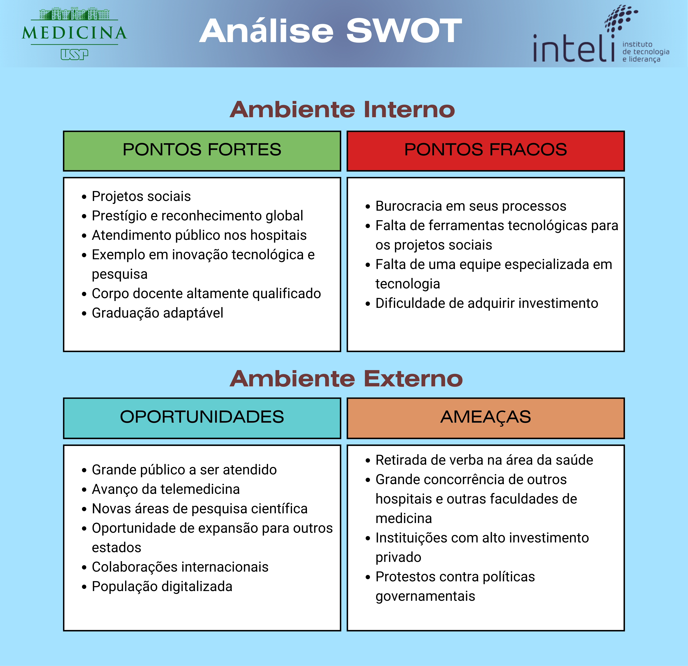

# GDD - Game Design Document - Módulo 1 - Inteli

## Tilápia

#### Gabriel Henrique Martins Alves
#### Gabriel Scarpelin Diniz
#### Isabelly Maia Montalvão
#### Leonardo Casal Andriolo
#### Matheus Jorge Rosa
#### Pietra Pasqualini Batista

## Sumário

[1. Introdução](#c1)

[2. Visão Geral do Jogo](#c2)

[3. Game Design](#c3)

[4. Desenvolvimento do jogo](#c4)

[5. Casos de Teste](#c5)

[6. Conclusões e trabalhos futuros](#c6)

[7. Referências](#c7)

[Anexos](#c8)

<br>


# <a name="c1"></a>1. Introdução (sprints 1 e 4)

## 1.1. Escopo do Projeto

### 1.1.1. Contexto da indústria (sprints 1 e 4)

&nbsp;&nbsp;&nbsp;&nbsp;A Faculdade de Medicina da USP é uma referência no campo da educação superior, destacando-se no ensino de Medicina no Brasil e na realização de pesquisas de ponta, além de campanhas de conscientização para a população. Competindo com outras instituições renomadas, como UNICAMP, PUC-SP e UNIFESP, a FMUSP se destaca por suas iniciativas inovadoras e seu impacto notável no mercado regional e nacional, especialmente através de suas campanhas e atividades clínicas de alto padrão.

&nbsp;&nbsp;&nbsp;&nbsp;Internacionalmente reconhecida, a FMUSP continua a liderar o caminho em pesquisas de vanguarda, abrangendo áreas como cirurgia com células-tronco, desenvolvimento de pele artificial e outras tendências futuras na medicina.

### 1.1.2. Análise SWOT (sprints 1 e 4)

&nbsp;&nbsp;&nbsp;&nbsp;Uma análise SWOT é uma técnica usada para identificar forças, oportunidades, fraquezas e ameaças para a sua empresa ou até para um projeto específico. Apesar de simples, a análise SWOT é uma ferramenta poderosa para identificar oportunidades de melhoria frente à concorrência¹.

<div align="center">

<sub>Figura 1 - Análise SWOT da FMUSP</sub>



<sup>Fonte: Material produzido pelos autores (2024)</sup></div>

&nbsp;&nbsp;&nbsp;&nbsp;Com a análise SWOT, foi possível observar características importantes, tais como os projetos sociais realizados pela Faculdade de Medicina da USP (FMUSP) e a carência de ferramentas tecnológicas para esses projetos sociais. Associados a esses pontos, destacam-se algumas oportunidades, como o amplo público atendido pela FMUSP e, sobretudo, a crescente digitalização mundial. Nesse contexto, o 'Game' foi desenvolvido com o objetivo de atenuar os pontos fracos, potencializar ainda mais os pontos fortes e aproveitar as oportunidades.

### 1.1.3. Descrição da Solução Desenvolvida (sprints 1 e 4)

&nbsp;&nbsp;&nbsp;&nbsp;A falta de conscientização sobre prevenção, primeiros socorros e informações inadequadas sobre queimaduras, em especial em populações vulneráveis, influi na alta incidência de queimaduras, que se torna uma das maiores causas de lesões traumáticas no mundo.<br>

&nbsp;&nbsp;&nbsp;&nbsp;São registrados cerca de 1 milhão de novos casos anualmente no Brasil, e acredita-se que 90% das queimaduras seriam evitadas com devida educação e conscientização da população. Grande parte das queimaduras registradas ocorrem em ambiente residencial e em atividades de lazer, abrangendo, em maioria, homens de 20 a 39 anos. <br>

&nbsp;&nbsp;&nbsp;&nbsp;O game visa conscientizar a população, em especial as vulneráveis, sobre queimaduras, à medida que fornece informações embasadas para estimular a educação de prevenção de queimaduras, além de auxiliar nos primeiros socorros e desmitificar métodos inapropriados de tratamentos.<br>

&nbsp;&nbsp;&nbsp;&nbsp;O game deverá ser acessado pelos smartphones dos estudantes e poderá ser utilizado durante as campanhas de conscientização promovidas pela Faculdade de Medicina da USP ou quando da preferência do usuário. A solução impulsiona os benefícios já fornecidos pelas campanhas de conscientização através de seu aspecto lúdico e divertido de compartilhar informações e combater desinformações. <br>

&nbsp;&nbsp;&nbsp;&nbsp;O critério de sucesso será a satisfação do jogador durante o processo de conscientização através de um game. Para avaliarmos tal critério, uma pesquisa de satisfação será realizada ao final do game, levando em consideração fatores como diversão, jogabilidade e transmissão de conhecimento.


### 1.1.4. Proposta de Valor (sprints 1 e 4)

&nbsp;&nbsp;&nbsp;&nbsp;A proposta de valor, é a essência do que um produto ou serviço oferece aos clientes e como atende às suas necessidades. Desenvolvida em torno do perfil do cliente e da proposta de valor da empresa, a proposta de valor busca alinhar os ganhos desejados, dores enfrentadas e trabalhos a serem realizados pelos clientes com os benefícios oferecidos, problemas resolvidos e produtos/serviços específicos da empresa. Essa ideia foi apresentada por Alexander Osterwalder e sua equipe em seu livro "Value Proposition Design: How to Create Products and Services Customers Want"².

<div align="center">

<sub>Figura 2 - Canvas da Proposta de Valor do Projeto</sub>


<sup>Fonte: Material produzido pelos autores (2024)</sup>
</div>

&nbsp;&nbsp;&nbsp;&nbsp;As maneiras pelas quais nosso jogo se conecta com o perfil do cliente, solucionando suas principais necessidades e impulsionando seus atuais ganhos foram esclarecidas com a elaboração desse canvas. Uma estratégia para enfrentar o problema do cliente de maneira objetiva foi traçada em conjunto com a análise SWOT e, com base nessas informações, o desenvolvimento inicial foi iniciado. 

&nbsp;&nbsp;&nbsp;&nbsp;Tendo em vista o perfil do cliente analisado através do *value proposition canvas*, ao observarmos suas dores, ganhos e necessidades, desenvolvemos uma proposta de solução totalmente gamificada. Essa proposta visa envolver os jovens, proporcionando-lhes um ambiente divertido que cumpra o principal objetivo do projeto: a conscientização. Destacamos, sobretudo, a necessidade de algo versátil e atrativo para o público-alvo, oferecendo uma experiência única e divertida, a fim de disseminar entre diversas pessoas e conscientizar cada vez mais a população.

### 1.1.5. Matriz de Riscos (sprints 1 e 4)

&nbsp;&nbsp;&nbsp;&nbsp;A Matriz de Riscos, também chamada de Matriz de Probabilidade e Impacto, é uma ferramenta utilizada, majoritariamente em empresas, para avaliar qual a probabilidade de um evento acontecer e qual o impacto que ele teria no empreendimento ou em um projeto⁴. A matriz é eficiente quando há necessidade de priorizar os riscos, sejam eles negativos (as ameaças) ou positivos (as oportunidades), ou seja, analisar e visualizar quais riscos merecem mais atenção no momento, auxiliando na criação de planos de ação para prevenir ou potencializar tal risco⁵.

&nbsp;&nbsp;&nbsp;&nbsp;A fim de gerenciar os riscos do nosso produto, a equipe construiu os gráficos que representam potenciais ameaças e oportunidades no projeto (figura 3 e figura 4, respectivamente), contribuindo efetivamente para a tomada de decisões estratégicas e planejamento de planos de ação. 

<div align="center">

<sub>Figura 3 - Matriz de Riscos</sub>


<sup>Fonte: Material produzido pelos autores (2024)</sup>
</div>

<div align="center">

<sub>Figura 4 - Matriz de Oportunidades</sub>


<sup>Fonte: Material produzido pelos autores (2024)</sup>
</div>

&nbsp;&nbsp;&nbsp;&nbsp;A análise dos riscos no projeto foi realizada com o objetivo de auxiliar o grupo a entender e lidar com possíveis ameaças e oportunidades. Sendo assim, conseguimos prever de forma mais eficaz certos eventos como, por exemplo, a possibilidade do usuário não entender a mecânica do jogo e criar, a partir dessa ameaça, um tutorial simples e esclarecedor. Além disso, foi possível visualizar que a parceria com a FMUSP gera um impacto social significante, indo de acordo com o que o projeto visa. Deste modo, chegamos nos seguintes planos de ação:

<div align="center">
<sub>Tabela 1: Requisitos do cliente</sub>
</div>


\# | Plano de ações:
--- | ---
1 | Atraso nas entregas dos afazeres: Apesar da equipe ser bem organizada com prazos e datas, o atraso nas entregas do backlog tem probabilidade de ocorrência média e impacto também médio. A solução ideal é realizar encontros breves diariamente (daily), para que todos os membros do grupo estejam cientes do andamento das funções individuais e coletivas, evitando sobrecargas e obstáculos desnecessários no desenvolvimento do projeto.
2 | Queda da internet durante o desenvolvimento do projeto: De forma geral, quedas e instabilidades na conexão estão fora do controle da equipe, sendo assim, não há efetivamente o que fazer além de esperar. No entanto, a probabilidade de que isso aconteça é baixa e o impacto seria médio, pois parte do desenvolvimento do projeto não requer uma conexão constante à internet.
3 | Falha no sistema do jogo: Para evitar falhas no sistema, a equipe realizará diversos testes para assegurar que tudo ocorrerá como o planejado. Caso aconteça algum imprevisto ou equívoco da nossa parte, realizaremos uma análise profunda para encontrar a raiz do problema e consertá-la.
4 | Não achar equilíbrio entre diversão e educação: Um dos nossos principais desafios é criar um jogo que conscientize a população, e que, ao mesmo tempo, seja divertido e envolvente. Caso o jogo seja focado na diversão, falharemos na entrega de educação, e vice-versa. Para tentar evitar ao máximo essa problemática, faremos testes com pessoas à nossa volta que sejam do público alvo do jogo para que termos críticas e feedbacks no que melhorar.
5 | O usuário não aprender com o jogo: Como um dos objetivos é a conscientização através do jogo, algumas soluções que a equipe entende como necessária e irá implementar para evitar o risco do usuário não aprender com o jogo são, garantir que o conteúdo educacional seja apresentado de maneira clara e concisa, aplicar o conhecimento adquirido em minigames durante o jogo e, utilizar de efeitos sonoros para indicar que uma ação foi satisfatória ou não. 
6 | Falta de comprometimento do grupo: A equipe está bastante empenhada para que o desenvolvimento do projeto seja o mais agradável possível, por isso essa problemática apresenta baixa probabilidade de ocorrência, no entanto, o impacto que a falta de comprometimento teria é alta e o melhor plano de ação para prevenir isso é a comunicação transparente e amigável entre os membros.
7 | Usuário sem acesso às tecnologias necessárias para jogar: Um dos principais motivos para a criação desse jogo é com o intuito de levar o conhecimento a todos, mas principalmente para aqueles que não tem fácil acesso à educação. Por esse motivo, a acessibilidade é uma prioridade e preocupação para a equipe. Para atingir  o máximo de usuário possível, a equipe tentará de tudo para oferecer o jogo além de mobile, mas que também funcione em uma versão web. Além disso, o jogo poderá ser executado em dispositivos mais antigos e que tenham menos capacidade de processamento. 
8 | Problemas com a trilha sonora: Uma ameaça de probabilidade e impacto baixos, pois se houver qualquer imprevisto com a trilha sonora, isso não irá impactar a mensagem ou a jogabilidade do jogo. O plano de ação é analisar e entender a raiz do problema e efetuar as alterações necessárias, além de realizar diversos testes em dispositivos diferentes.
9 | Erros/Alterações visuais (ex: erros gramaticais): Ainda que a equipe Tilápia seja cuidadosa, é normal que aconteçam erros e alterações visuais durante o desenvolvimento do jogo. Por se tratar de falhas relativamente simples de serem resolvidas, o impacto acaba sendo baixo. A solução mais eficiente para ambos é a atenção redobrada para evitar erros e, no caso das alterações puramente estéticas, para não tirar o foco do que realmente importa.
10 | O usuário não se engaja com o jogo: Por ser um jogo com o intuito educativo, é possível que haja problemas no engajamento do usuário. Para evitar ao máximo essa problemática, a equipe desenvolverá no jogo elementos de recompensa para motivar o usuário, como por exemplo, método de pontuação e vida, quiz e tempos limitados para a realização dos objetivos. Além disso, o jogo fica cada vez mais desafiador à medida que o jogador ganha experiência e familiaridade. 
11 | Sobrecarga em relação à habilidades (ex: membros que sabem programar melhor que outros): A probabilidade de haver uma sobrecarga de funções nos membros que têm mais facilidade e familiaridade com programação é alta, no entanto isso terá um impacto significativo à medida que as responsabilidades ficarão desproporcionais em relação ao resto do grupo. Para esse problema, a solução é misturar o grupo para que todos trabalhem em todas as áreas do projeto, mesmo aqueles que têm dificuldades.
12 | O usuário tem dificuldade em entender a dinâmica e mecânica do jogo: Entender como se joga um jogo é essencial para o sucesso do mesmo e a falha na compreensão pode gerar estresse e desinteresse. Para que isso não aconteça, a jogabilidade deve estar alinhada com nível do usuário e o tutorial deve ser bem informativo e esclarecedor, para que o jogo siga um fluxo divertido e intuitivo.
13 | Concorrência com outros jogos: A concorrência com outros jogos é um risco de probabilidade alta e impacto também alto, visto que poderíamos perder clientes, dito isso, uma solução viável seria desenvolver novas estratégias de marketing para o jogo e garantir atualizações que inovem o produto.

## 1.2. Requisitos do Projeto (sprints 1 e 2)

&nbsp;&nbsp;&nbsp;&nbsp;Esta seção tem como objetivo fornecer uma visão abrangente e detalhada dos requisitos essenciais que orientarão o desenvolvimento do projeto. Aqui, serão delineadas as funcionalidades, características e restrições fundamentais para garantir a compreensão unificada entre a equipe de desenvolvimento e o cliente.

<div align="center">
<sub>Tabela 2: Requisitos do cliente</sub>
</div>

\# | Requisito do cliente 
--- | ---
1|Ensinar quais são as três camadas da pele;
2|Falar sobre a espessura das camadas da pele e qual a relação delas com os tipos de queimadura;
3|Definir os diferentes tipos de queimadura;
4|Dizer por que uma queimadura profunda não dói;
5|O jogo deve ser compatível com mobile;
6|A paleta de cores deve ser da FMUSP e do INTELI;
7|Tempo limitado apenas com a intenção de capacitação, sendo uma experiência única, de aproximadamente 15 minutos;
8|Jogo tem de atrair o interesse dos alunos;
9|Deve ter recompensas, pontuação, recordes;
10|Pode ser expandido para fora das escolas;
11|O jogo não aborda formas de tratamento;
12|Focar na prevenção e no que NÃO fazer;
13|Desmistificação de mitos.
<div align="center">
<sub>Tabela 3: Requisitos do cliente</sub>
</div>

\# | Requisito do grupo 
--- | ---
1 | No jogo deve ser implementado um menu inicial com um botão “inciar”;
2 |O jogo deve conter uma sala de recepção, sala de espera para os pacientes, Farmácia com questionário e uma biblioteca com livros para se adquirir conhecimento;
3 |Deve ser adicionado ao jogo um sistema de recompensa tendo como base o tempo de atendimento, os acertos no questionário e a satisfação do cliente;
4 |Adicionar efeitos sonoros, música de fundo por meio do framework phaser; 
5 | deve ter animações que serão feitas com spritesheet;
6 |Irá conter uma arte gráfica pixelada, feita com auxílio do piskel;
7 |Inputs de movimentação com o touch screen de dispositivos mobile
8 |Implementação de movimento vetorial para normalização de velocidade;
9 |Programar mudança de cenas para ter um código funcional do menu;
10 |Adicionar animações ao personagem com spritesheet;
11 |Adicionar tecla de input para interação com outros objetos ou personagens;
12 |Fazer quiz na Farmácia com mudança de cenas;
13 |O jogo deve ser rápido, com um tempo de duração de em média 10 minutos;
14 |Terá possibilidade de rejogabilidade;
15 |Adquirir pontos em forma de conhecimento e remédio com estilo mágico para não passar a impressão de ser um remédio verdadeiro;
16 |Ter a logo do Hospital das Clínicas, entre outras referências;
17 |Ter uma grande sala com foco no personagem, utilizando dinâmica de câmeras;
18 |Caixa de diálogo com NPC para instruir o personagem principal sobre quais serão seus próximos passos.

&nbsp;&nbsp;&nbsp;&nbsp;Listar esses pontos em uma tabela auxiliou o grupo a se organizar melhor para a produção de requisitos alinhados com os do cliente e a ter um maior entendimento do projeto, visando sempre o atenditmento dos pedidos do cliente. E, ao mesmo tempo, ajudou o grupo a organizar as tarefas de forma eficiente, ou seja, abrangendo todos os pontos listados e propotcionando uma divisão igualitária dessas tarefas.

## 1.3. Público-alvo do Projeto (sprint 2)

&nbsp;&nbsp;&nbsp;&nbsp;De acordo com Kotler (2000)⁵, também conhecido como o “pai do marketing”, o público alvo é o grupo de consumidores que possui necessidades semelhantes àquelas que a empresa atende. O público alvo pode ser dividido em diversos fatores tais quais: geografia, demografia, psicografia e comportamento⁶. 

&nbsp;&nbsp;&nbsp;&nbsp;O nosso jogo é pensado e destinado à adolescentes e jovens adultos que fazem parte de comunidades e regiões carentes com acesso limitado à educação, visto que o objetivo principal do projeto é a conscientização e 90% dos incidentes envolvendo queimaduras são reportados em locais onde a população é leiga⁷. 


&nbsp;&nbsp;&nbsp;&nbsp;Portanto, para que a magnitude da influência e impacto gerado do nosso produto seja positiva, definimos o público alvo levando em consideração os aspectos demográficos, especificamente a idade, renda e educação. 
Posto isso, foi entendido que a definição adequada do público alvo aumenta a magnitude da influência e impacto gerado, o que vai de acordo com o nosso objetivo principal.

# <a name="c2"></a>2. Visão Geral do Jogo (sprint 2)

## 2.1. Objetivos do Jogo (sprint 2)

&nbsp;&nbsp;&nbsp;&nbsp;O objetivo de um jogo geralmente é a meta que os jogadores devem alcançar para vencer ou progredir. Pode envolver completar tarefas específicas, resolver quebra-cabeças, derrotar inimigos, acumular pontos, entre outros desafios.

&nbsp;&nbsp;&nbsp;&nbsp;Para o nosso jogo, o objetivo é atender o máximo de pacientes em um tempo determinado passando por um ciclo de estudo e prática, obtendo assim uma pontuação final que pode ser superada a cada novo ciclo. Isso incentiva que os jogadores equilibram eficiência no atendimento e aprimoramento de habilidades através da aprendizagem.

## 2.2. Características do Jogo (sprint 2)

### 2.2.1. Gênero do Jogo (sprint 2)

&nbsp;&nbsp;&nbsp;&nbsp;O gênero se refere à classificação ou categoria que descreve o estilo e a mecânica de jogo predominantes. Cada gênero tem características específicas que definem como os jogadores interagem com o jogo e o que podem esperar dele em termos de jogabilidade, narrativa e objetivos⁸.

&nbsp;&nbsp;&nbsp;&nbsp;O nosso jogo simula a atuação de um médico na triagem dos pacientes, portanto seu gênero é simulação. Como tal, o jogo oferece uma experiência imersiva e educativa, onde os jogadores podem aprender sobre prevenção de queimaduras e sobre o que deve-se ou não fazer logo após se queimar.

### 2.2.2. Plataforma do Jogo (sprint 2)

&nbsp;&nbsp;&nbsp;&nbsp;A plataforma de um jogo se refere ao ambiente ou sistema no qual o jogo é executado. Isso inclui dispositivos como computadores, consoles de videogame, smartphones, tablets, entre outros, e também o sistema operacional ou plataforma online que suporta a execução do jogo.

&nbsp;&nbsp;&nbsp;&nbsp;O jogo será desenvolvido para dispositivos móveis, como smartphones e tablets, e oferecerá uma experiência acessível e portátil. A interface será otimizada para telas sensíveis ao toque, permitindo aos jogadores interagirem intuitivamente com os elementos do jogo. Além disso, a natureza móvel desses dispositivos permitirá que os jogadores acessem o jogo em qualquer lugar, tornando-o conveniente para ser usado na educação.

&nbsp;&nbsp;&nbsp;&nbsp;A aplicação também poderá ser acessado via web, oferecendo flexibilidade adicional aos jogadores, que poderão jogar diretamente de seus navegadores sem a necessidade de downloads adicionais. Isso tornará o jogo acessível a uma ampla gama de dispositivos, garantindo que mais pessoas possam participar e aprender sobre a importância da prevenção de queimaduras.

### 2.2.3. Número de jogadores (sprint 2)

&nbsp;&nbsp;&nbsp;&nbsp;O número de jogadores de um jogo refere-se à quantidade de participantes que podem jogar simultaneamente ou de forma sequencial. Esse aspecto é fundamental na definição da dinâmica do jogo, determinando se é um jogo para um único jogador, para dois jogadores, ou para múltiplos jogadores. O número de jogadores pode influenciar elementos como competição, colaboração, estratégia e interação social dentro do jogo.

&nbsp;&nbsp;&nbsp;&nbsp;No contexto do nosso jogo sobre prevenção de queimaduras, a opção de um jogador oferecerá uma experiência individualizada e centrada no aprendizado. Isso permitirá um foco maior na absorção de informações e na prática de habilidades específicas, como identificar riscos de queimaduras e tomar decisões preventivas adequadas. Além disso, jogar sozinho pode facilitar a personalização da experiência de acordo com o ritmo e as necessidades individuais do jogador.

### 2.2.4. Títulos semelhantes e inspirações (sprint 2)

&nbsp;&nbsp;&nbsp;&nbsp;Títulos semelhantes e inspirações de um jogo referem-se a outros jogos que compartilham características, temas, mecânicas de jogo ou atmosfera semelhantes com o jogo que está sendo desenvolvido. Ao analisar títulos semelhantes, podemos identificar elementos que foram bem-sucedidos em outros jogos e incorporá-los ao nosso próprio projeto. Já as inspirações nos forneceram uma fonte de criatividade e direção para o desenvolvimento do jogo.

&nbsp;&nbsp;&nbsp;&nbsp;Para a concepção do jogo, foram utilizados os seguites jogos como referência de jogabilidade e design:

* [Overcooked](https://www.team17.com/games/overcooked/)<br>
* [Hospital Questiona](https://metodoquestiona.com.br/)<br>
* [Stardew Valley](https://www.stardewvalley.net/)<br>

### 2.2.5. Tempo estimado de jogo (sprint 5)

*Ex. O jogo pode ser concluído em 3 horas passando por todas as fases.*

*Ex. cada partida dura até 15 minutos*

# <a name="c3"></a>3. Game Design (sprints 2 e 3)

## 3.1. Enredo do Jogo (sprints 2 e 3)

&nbsp;&nbsp;&nbsp;&nbsp;O jogador encarna o papel de Residente, um jovem médico recentemente formado, prestes a iniciar sua jornada no desafiador mundo da medicina. Ao ingressar na equipe do pronto-socorro de queimaduras, ele é guiado pela experiente Dra. Tina, uma figura respeitada no campo da medicina de emergência.

&nbsp;&nbsp;&nbsp;&nbsp;Inicialmente, o Residente é confrontado com situações desafiadoras e momentos de incerteza, nos quais sua inexperiência se manifesta de maneira evidente. No entanto, à medida que ele se envolve em diagnósticos, tratamentos de emergência e tomadas de decisão rápidas, ele começa a perceber que sua verdadeira jornada como médico está apenas começando.

&nbsp;&nbsp;&nbsp;&nbsp;Ao longo do jogo, o Residente é confrontado com uma série de desafios que testam suas habilidades técnicas, sua eficiência e sua ética . Ele se encontra diante de pacientes cujas vidas dependem de suas decisões, exigindo coragem e determinação para superar obstáculos e salvar vidas.

&nbsp;&nbsp;&nbsp;&nbsp;À medida que o Residente avança em sua jornada, ele não apenas ganha confiança em suas habilidades clínicas, mas também cresce como profissional. Ele aprende lições importantes sobre a prevenção de queimaduras e o domínio sobre os procedimentos de primeiros socorros.

## 3.2. Personagens (sprints 2 e 3)

### 3.2.1. Controláveis

&nbsp;&nbsp;&nbsp;&nbsp;O termo "personagem controlável" refere-se àqueles avatares que são comandados pelo jogador através de comandos de movimento, ações, combate, dentre outros⁹.

&nbsp;&nbsp;&nbsp;&nbsp;O jogo referido neste documento terá apenas um personagem controlável em jogo, porém o jogador poderá selecionar o sexo do protagonista, ou seja, haverá duas opções: O residente médico protagonista masculino e a residente médica protagonista feminina. Não será possível jogar com mais de um personagem controlável ao iniciar o jogo, portanto ele só poderá ser alterado quando o jogador retornar ao menu inicial. O nome do personagem controlável masculino é X e Y, o nome da protagonista feminina. O avatar controlável será um(a) residente médico(a) especializando-se na área de cirurgia plásticas, especialmente em casos de pacientes que sofreram queimaduras. X ou Y é guiado pela Dra. Tina durante seu expediente e possui habilidades para atender os pacientes, consultar livros na Biblioteca para adquirir conhecimento e responder às perguntas na Farmácia para receber o remédio (fictício) necessário para tratar o cliente.

### 3.2.2. Non-Playable Characters (NPC)


&nbsp;&nbsp;&nbsp;&nbsp;Personagens não controláveis (NPCs) são avatares que o jogador não possui controle direto, portanto não comandam seus movimentos e ações específicas⁹. Em nosso projeto, haverá vários NPCs, dos quais 6 representarão os pacientes a serem atendidos pelo jogador através do personagem principal e um será a Dra. Tina, NPC responsável por guiar o jogador sobre o fluxo de jogabilidade e tutoriais em pontos específicos.

### 3.2.3. Diversidade e Representatividade dos Personagens

&nbsp;&nbsp;&nbsp;&nbsp; De acordo com o nosso público-alvo, o jogo em questão não apenas oferecerá uma variedade de personagens, mas também buscará causar um impacto social por meio da inclusão e diversidade. A personagem Dra. Tina foi criada para representar uma parcela significativa da população brasileira: pessoas pardas/pretas, conforme indicado pelo Censo de 2022. Nossa abordagem visa não apenas incluir personagens pretos como secundários, mas também posicioná-los como protagonistas da história. Assim, a Dra. Tina desempenha o papel principal ao guiar o personagem principal durante toda a jornada, fornecendo instruções e sendo a figura central por trás de todos os eventos que ocorrem dentro do jogo. Além disso, o projeto visa abordar outras raças e diferentes culturas nos personagens, e a expectativa é que, com o avanço do projeto, os NPCs sejam desenvolvidos para representar ainda mais parcelas da população sub-representadas.

## 3.3. Mundo do jogo (sprints 2 e 3)

### 3.3.1. Locações Principais e/ou Mapas (sprints 2 e 3)

&nbsp;&nbsp;&nbsp;&nbsp;O jogo se passa em um fase única e cíclica composta pelos seguintes ambientes:

&nbsp;&nbsp;&nbsp;&nbsp;Sala de Triagem: Onde os pacientes chegam ao hospital e são inicialmente avaliados pelo jogador, que, no papel do médico residente, avalia a gravidade das queimaduras dos pacientes. 

&nbsp;&nbsp;&nbsp;&nbsp;Consultório: Após a triagem, o paciente se desloca para o consultório, onde aguarda o médico voltar com seu tratamento.

&nbsp;&nbsp;&nbsp;&nbsp;Biblioteca: Um ambiente onde o jogador pode acessar informações sobre prevenção de queimaduras e procedimentos de primeiros socorros de acordo com o paciente que está atendendo.

&nbsp;&nbsp;&nbsp;&nbsp;Farmácia: Lugar em que o jogador aplica os conhecimentos adquiridos para que consiga o remédio (representativo) correto para que consiga tratar o paciente.

<div align="center">

<sub>Figura 5 - Mapa do Jogo</sub>


<sup>Fonte: Material produzido pelos autores (2024)</sup>
</div>

### 3.3.2. Navegação pelo mundo (sprints 2 e 3)

&nbsp;&nbsp;&nbsp;&nbsp;O jogador controla o médico residente, utilizando controles direcionais de dispositivos móveis tocando na tela e arrastando o dedo na direção desejada, possibilitando a movimentação de uma área para outra dentro dos limites do hospital e interagindo com possíveis objetos e pacientes por meio de uma colisão.

&nbsp;&nbsp;&nbsp;&nbsp;No jogo, o acesso às diferentes salas e ambientes é automático e não requer desbloqueio. No entanto, para interagir com objetos e pacientes e acessar certas funcionalidades, existem condições específicas a serem cumpridas.

&nbsp;&nbsp;&nbsp;&nbsp;Na sala de triagem, o jogador pode se mover livremente e deve se aproximar de um paciente para visualizar e avaliar seu prontuário. Após a avaliação, o paciente é transferido automaticamente para o consultório.

&nbsp;&nbsp;&nbsp;&nbsp;A Biblioteca está disponível para o Residente a qualquer momento. Para acessar as informações, basta colidir com uma estante. O conteúdo da Biblioteca permanece o mesmo, independente do paciente sendo atendido.

&nbsp;&nbsp;&nbsp;&nbsp;Na Farmácia, o Residente deve colidir com um objeto para iniciar um jogo de perguntas. As perguntas variam de acordo com o histórico do paciente, tornando essa funcionalidade disponível apenas após a triagem. Ao responder corretamente, o jogador recebe uma pílula de tratamento.

&nbsp;&nbsp;&nbsp;&nbsp;O Residente retorna ao consultório, onde o paciente o espera, para administrar o tratamento após identificar a medicação correta. Esse procedimento só é possível se o médico tiver triado o paciente corretamente e recebido a medicação após o quiz.


### 3.3.3. Condições climáticas e temporais (sprints 2 e 3)

&nbsp;&nbsp;&nbsp;&nbsp;No jogo, o tempo é um elemento que adiciona diversão e desafio à experiência do jogador. 
Um cronômetro é utilizado para medir o tempo que o jogador tem para completar cada ciclo de cuidado com o paciente no pronto-socorro de queimaduras. 

&nbsp;&nbsp;&nbsp;&nbsp;O desafio está em cumprir o máximo de ciclos no tempo estipulado, o que cria uma sensação de urgência e emoção. O jogador é recompensado com pontuações mais altas por sua eficiência e rapidez, incentivando repetições para melhorar o desempenho. No entanto, erros resultam na perda de tempo, tornando essencial tomar decisões cuidadosas e precisas durante o jogo. 

&nbsp;&nbsp;&nbsp;&nbsp;Em resumo, o cronômetro adiciona dinamismo e intensidade à jogabilidade, mantendo os jogadores engajados e focados em suas tarefas.

### 3.3.4. Concept Art (sprint 2)

&nbsp;&nbsp;&nbsp;&nbsp;As Concepts Arts são desenhos desenvolvidos com o objetivo de conceituar elementos do jogo como personagens, itens, cenários, etc¹⁰. Para nosso jogo, as concepts arts desenvolvidas estão listadas abaixo:

<div align="center">

<sub>Figura 6 - Concept Art do Mapa</sub>


<sup>Fonte: Material produzido pelos autores (2024)</sup>

</div>

&nbsp;&nbsp;&nbsp;&nbsp;A Figura 6: Concept Art representando o Mapa do Jogo.

<div align="center">

<sub>Figura 7 - Concept Art do Prontuário</sub>


<sup>Fonte: Material produzido pelos autores (2024)</sup>

</div>

&nbsp;&nbsp;&nbsp;&nbsp;A Figura 7: Concept Art do prontuário dos pacientes.

<div align="center">

<sub>Figura 8 - Concept Art da Página de Livros</sub>


<sup>Fonte: Material produzido pelos autores (2024)</sup>

</div>

&nbsp;&nbsp;&nbsp;&nbsp;Figura 8: Concept Art da Página do Livro.

### 3.3.5. Trilha sonora (sprint 3)

&nbsp;&nbsp;&nbsp;&nbsp;As trilhas sonoras são meios de envolver o usuário no jogo, segundo o artigo "The Role of Music in Videogames" - O papel da música nos videogames - cujo autor, citado no artigo da BBC ¹⁴, afirma que as trilhas sonoras nos jogos são multifuncionais, pois significam várias coisas para o jogador. Isso inclui o aumento da imersão, as brechas para mudanças na história, além de contribuírem também para a estética do jogo, tornando-se assim um fator muito importante para o envolvimento do jogador na narrativa.

<div align="center">
<sub>Tabela X: Lista de músicas</sub>
</div>

\# | Título | Ocorrência | Autoria
--- | --- | --- | ---
1 | Tema de abertura e durante o tutorial | Tela de início e Cena da faculdade | FoolBoyMedia (CC BY-NC 4.0)
2 | Tema principal | Cena da faculdade após a introdução | BloodPixelHero (CC BY 4.0)

&nbsp;&nbsp;&nbsp;&nbsp;Tendo como referência o artigo mencionado, as músicas selecionadas foram cuidadosamente escolhidas para transmitir a atmosfera do jogo, com o objetivo de proporcionar uma imersão mais profunda por parte do jogador. No menu e no tutorial, optamos por músicas com ritmo mais lento, oferecendo uma introdução tranquila e acolhedora ao universo do jogo. No entanto, à medida que a dinâmica do jogo se intensifica, marcada pelo início do cronômetro e pelo aumento da velocidade das ações, uma trilha sonora com batidas mais pulsantes é ativada, elevando a energia e a intensidade da experiência de jogo.

## 3.4. Inventário e Bestiário (sprint 3)

### 3.4.1. Inventário

&nbsp;&nbsp;&nbsp;&nbsp;Não se aplica.

### 3.4.2. Bestiário

&nbsp;&nbsp;&nbsp;&nbsp;Não se aplica.

## 3.5. Gameflow (Diagrama de cenas) (sprint 2)

&nbsp;&nbsp;&nbsp;&nbsp;Um Diagrama de Cenas é uma ferramenta utilizada para auxiliar na organização do desenvolvimento técnico do jogo, apresentando as cenas do projeto e suas relações com outras cenas, exibindo os caminhos possíveis e bloqueios¹¹ ¹². Nosso Diagrama de Cenas pode ser visitado aqui: https://miro.com/app/board/uXjVNmuHdDw=/?share_link_id=114285260269.

<div align="center">

<sub>Figura 9 - Visão geral do Diagrama de Cenas</sub>


<sup>Fonte: Material produzido pelos autores (2024)</sup>

</div>

&nbsp;&nbsp;&nbsp;&nbsp;1 - Ao abrir o menu e clicar no botão “JOGAR”, o jogo iniciará. A tela inicial do jogo se passa no hospital onde chegarão os pacientes a serem orientados, vítimas de queimaduras.

<div align="center">

<sub>Figura 10 - Menu do Jogo</sub>


<sup>Fonte: Material produzido pelos autores (2024)</sup>

</div>

&nbsp;&nbsp;&nbsp;&nbsp;2 - No Hall Principal do Hospital, o jogador poderá ir para a Biblioteca, onde poderá ler livros sobre primeiros socorros, tratamento e prevenção de queimaduras. No entanto, apesar do jogador poder ir à Farmácia, ela estará bloqueada, pois nenhum paciente foi atendido.

<div align="center">

<sub>Figura 11 - Hospital</sub>


<sup>Fonte: Material produzido pelos autores (2024)</sup>

</div>

&nbsp;&nbsp;&nbsp;&nbsp;3 - Após recepcionar o paciente no Hall Principal, o médico se dirigirá a Triagem, onde realizará a triagem do paciente para investigar como o trauma foi causado. 

<div align="center">

<sub>Figura 12 - Triagem</sub>


<sup>Fonte: Material produzido pelos autores (2024)</sup>

</div>

&nbsp;&nbsp;&nbsp;&nbsp;4 - Após a triagem, o médico deverá ir à biblioteca para estudar sobre primeiros socorros, métodos de prevenção sobre o caso de seu paciente e mitos a serem desmistificados. 

<div align="center">

<sub>Figura 13 - Biblioteca</sub>


<sup>Fonte: Material produzido pelos autores (2024)</sup>

</div>

&nbsp;&nbsp;&nbsp;&nbsp;5 - Com o conhecimento adquirido na biblioteca, o médico agora pode ir à Farmácia (bloqueada caso não antes realizar a triagem do paciente) e realizar o quiz para aquisição do remédio para tratamento do paciente.

<div align="center">

<sub>Figura 14 - Farmácia</sub>


<sup>Fonte: Material produzido pelos autores (2024)</sup>

</div>

&nbsp;&nbsp;&nbsp;&nbsp;6 - Adquirindo o remédio, o médico deverá entregá-lo ao paciente, que estará na Sala de Espera, concluindo o ciclo de vida deste NPC no jogo e rendendo pontos ao jogador. Após conclusão do ciclo, o jogador deve inicia-lo novamente.

<div align="center">

<sub>Figura 15 - Sala de Espera</sub>


<sup>Fonte: Material produzido pelos autores (2024)</sup>

</div>

&nbsp;&nbsp;&nbsp;&nbsp;7 - É importante notar que na etapa 2, o Jogador tem a opção de seguir um caminho diferente do ideal para o andamento do ciclo de jogo, indo à Biblioteca antes de inicializar o tratamento de um paciente na Triagem.

<div align="center">

<sub>Figura 16 - Caminho a Biblioteca</sub>


<sup>Fonte: Material produzido pelos autores (2024)</sup>

</div>

&nbsp;&nbsp;&nbsp;&nbsp;8 - Apesar de ser possível a passagem para a Biblioteca, o Jogador não estará permitido ir à Farmácia, dado que ainda não inicializou o atendimento a nenhum paciente e, portanto, não terá que responder a um Quiz específico.

<div align="center">

<sub>Figura 17 - Farmácia Bloqueada</sub>


<sup>Fonte: Material produzido pelos autores (2024)</sup>

</div>

## 3.6. Regras do jogo (sprint 3)

&nbsp;&nbsp;&nbsp;&nbsp;As regras de um jogo, segundo o livro “Regras do Jogo: Fundamentos do Design de Jogos (Volume 1)”, moldam a experiência do jogador, fornecem estrutura e significado, e promovem a interatividade ao definirem limites, objetivos e desafios. Com isso o jogador é, de certa forma, guiado a seguir a lógica (gameflow) própria daquele jogo.


&nbsp;&nbsp;&nbsp;&nbsp;Em nosso jogo, o personagem principal deve concluir o máximo de ciclos em um determinado tempo, obtendo assim uma pontuação que o jogador deve tentar superar a cada vez que jogar. Esses ciclos seguem uma lógica que consiste na apresentação do problema, auto estudo e teste do conhecimento adquirido; que ocorrerão, respectivamente, no encontro com a doutora Tina, na tenda de livros e na barraca do quiz. 


&nbsp;&nbsp;&nbsp;&nbsp;Ao interagir com a doutora, será apresentado ao jogador um caso de uma pessoa que sofreu uma queimadura. Após obter as informações do caso, o jogador deve se dirigir para a tenda de livros, onde irá ler sobre aquele caso para adquirir conhecimento e por fim colocará isso em prática no local do quiz, em que será feita uma pergunta e, com base nos acertos e no tempo que o jogador demorar em cada ciclo, obterá uma pontuação.

## 3.7. Mecânicas do jogo (sprint 3)

&nbsp;&nbsp;&nbsp;&nbsp;O MDA, que foi apresentado pela primeira vez na  Conferência *Foundations of Digital Games* no artigo chamado *MDA: A Formal Approach to Game Design and Game Research*, é um *framework* desenvolvido por Robin Hunicke, Marc LeBlanc e Robert Zubek. Ele é muito utilizado no mundo do design de *games* para ajudar os produtores a criarem uma experiência imersiva e de altíssima qualidade para seu usuário. Isso é possível pela fragmentação do jogo em três aspectos: mecânica, dinâmica e estética. 

&nbsp;&nbsp;&nbsp;&nbsp;Segundo os desenvolvedores desse *framework*, as mecânicas são as várias ações, comportamentos e mecanismos de controle oferecidos ao jogador dentro de um contexto de jogo. Juntamente com o conteúdo do jogo (níveis, ativos e
assim por diante), a mecânica suporta a dinâmica geral da jogabilidade. Ou seja, as mecânicas compõem a parte mais fundamental do ponto de vista do desenvolvedor, pois são a base para a criação de dinâmicas, que, por sua vez, criam estéticas únicas, o que agrega valor ao produto desenvolvido.


&nbsp;&nbsp;&nbsp;&nbsp;Em nosso jogo as principais mecânicas são: tempo, limitadores de mapa, colisão com objetos, eventos ativados com colisão, resposta a questões objetivas, pontuação de acordo com velocidade e acertos, utilização das teclas WASD para movimentação do personagem no computador e joystick no celular. Essas mecânicas compõem a lógica fundamental de nosso jogo e fazem com que ele tenha uma dinâmica que coage o jogador a ter velocidade em sua ação e o guia a seguí-la.


# <a name="c4"></a>4. Desenvolvimento do Jogo

## 4.1. Desenvolvimento preliminar do jogo (sprint 1)

&nbsp;&nbsp;&nbsp;&nbsp;A primeira versão do jogo possui duas cenas, uma de início e uma de jogo. Ambas possuem arte gráfica provisória e foram desenvolvidas com o intuito de serem apresentadas na reunião com o parceiro ao final do Sprint 1.

<div align="center">

<sub>Figura 18 - Cenas de jogo</sub>

<p align="middle">
    
    
</p>
<sup>Fonte: Material produzido pelos autores (2024)</sup>

</div>

&nbsp;&nbsp;&nbsp;&nbsp;A cena de início é uma artimanha de programação e será transformada futuramente em um arquivo JavaScript separado ao adquirirmos o conhecimento para tal. De momento, criamos duas imagens, um layer a frente das outras, e as removemos por um evento acionado pelo clique do mouse no botão “Jogar”.

<div align="center">

<sub>Figura 19 - Cena de início</sub>

<p align="middle">
    
    
</p>
<sup>Fonte: Material produzido pelos autores (2024)</sup>

</div>

&nbsp;&nbsp;&nbsp;&nbsp;A cena de jogo é composta por duas imagens também, uma simulando o cenário do jogo e outra, o personagem jogável, uma figura de médico. O personagem possui movimento direcional controlado pelas teclas WASD, como será exposto abaixo. Adaptações para os _inputs_ estão listados abaixo.

<div align="center">

<sub>Figura 20 - Cena de jogo</sub>

<p align="middle">
    
    
</p>
<sup>Fonte: Material produzido pelos autores (2024)</sup>

</div>

&nbsp;&nbsp;&nbsp;&nbsp;Para iniciar a explicação do código, dentro do arquivo `“cena1.js”`, carregamos as imagens na função `preload()` e as criamos na função `create()`, como mostrado a seguir.

```js
function preload() {
    // Carregamento de imagens
    this.load.image('cenaHospital', 'assets/cenaHospital.png'); // Fundo da cena do Hospital
    this.load.image('cenaMainMenu', 'assets/cenaMainMenu.png'); // Fundo da cena do Main Menu
    this.load.image('botaoJogar', 'assets/botaoJogar.png');     // Imagem para botaoJogar
    this.load.image('medico', 'assets/medico.png');             // Imagem para medico
    }
```
```js
function create () {
    // Carrega a cena Main Menu
    mainMenu = this.add.image(667, 362, 'cenaMainMenu').setDepth(2).setScale(1.005);    // setDepth -> Muda profundidade para frente
    botaoJogar = this.add.image(830, 575, 'botaoJogar').setInteractive().setDepth(2);
```
```js
    // Cena Hospital
    this.add.image(667, 362, 'cenaHospital');       // Cria e posiciona o Fundo
    medico = this.add.image(400, 300, 'medico');    // Cria e posiciona o Medico
    medico.setFlip(true, false);                    // Ajusta a orientação do Medico
```
&nbsp;&nbsp;&nbsp;&nbsp;Após o carregamento das imagens da cena do menu, configuramos uma série de eventos que ajustam o comportamento da imagem da setinha ao passar sobre o botão "Jogar" e o que ocorre ao clicá-lo.
```js
// Ajuste visual da imagem do mouse para fornecer feedback que o botão jogar é interativo
    botaoJogar.on("pointerover", () => {        // Evento de passar o mouse sobre o botaoJogar
        this.input.setDefaultCursor("pointer"); // Cursor vira mãozinha
    });
    botaoJogar.on("pointerout", () => {         // Evento de retirar o mouse do botaoJogar
        this.input.setDefaultCursor("default"); // Cursor vira setinha
    });

    // Evento disparado ao clicar no botão (Código temporário apenas para demonstração da funcionalidade na sprint 1)
    botaoJogar.on("pointerdown", () => {        // Evento de click do mouse
        mainMenu.destroy();                     // Remoção da imagem mainMenu da tela
        botaoJogar.destroy();                   // Remoção da imagem botaoJogar da tela
        this.input.setDefaultCursor("default"); // Retorno do cursor do mouse para setinha
    });
```
&nbsp;&nbsp;&nbsp;&nbsp;Após o clique do botão jogar e remoção dos elementos da cena inicial, foram implementados os controles básicos de movimento para o personagem utilizando as teclas WASD do teclado. O código da movimentação começou com a definição de um objeto para cada tecla na função `create()`. Por exemplo, o objeto `keyA` recebeu o _input_ da tecla “A” do teclado, como visto abaixo. 
```js
    // Inicializa as variáveis para movimentação do personagem
    keyA = this.input.keyboard.addKey(Phaser.Input.Keyboard.KeyCodes.A); 
    keyW = this.input.keyboard.addKey(Phaser.Input.Keyboard.KeyCodes.W); // O código de cada tecla e o modo pelo qual devemos "chamá-la"
    keyS = this.input.keyboard.addKey(Phaser.Input.Keyboard.KeyCodes.S); // encontram-se na linha 115000 do arquivo "phaser.js"
    keyD = this.input.keyboard.addKey(Phaser.Input.Keyboard.KeyCodes.D);
```
&nbsp;&nbsp;&nbsp;&nbsp;Posteriormente, na função `update()`, implementamos uma lógica para atualizar a posição do médico um número de _pixels_ ao acionar cada tecla individualmente. Foi criada uma variável chamada `pixelMove` do tipo _const_ para ajustar um número fixo de _pixels_ que a figura do médico deve mover ao receber o _input_ de cada tecla. Um detalhe adicional é a mudança de orientação da figura do personagem ao acionar as teclas de movimentação do eixo horizontal, teclas “A” e “D”. Vale ressaltar que, por conta de utilizarmos apenas o condicional `if` na notação do _“if/else”_, ela torna-se inclusiva, ou seja, é possível clicar em mais de uma tecla ao mesmo tempo, possibilitando o movimento diagonal.
```js
    // Mapeamento de Inputs (Normalizar o movimento diagonal futuramente)
    if (keyA.isDown) {
        medico.x -= pixelMove;
        medico.setFlip(true, false); // Ajusta orientação do personagem
    }
    if (keyD.isDown) {
        medico.x += pixelMove;
        medico.setFlip(false, false); // Ajusta orientação do personagem
    }   
    if (keyS.isDown) {
        medico.y += pixelMove;
    } 
    if (keyW.isDown) {
        medico.y -= pixelMove;
    }
```
&nbsp;&nbsp;&nbsp;&nbsp;Como o personagem não possui física ou colisão, é possível movimentá-lo para fora da cena do hospital. Com o intuito de evitar esse comportamento, foi implementado provisoriamente o código a seguir que reposiciona-o de volta à cena sempre que atingir uma borda.
```js
    // Reposiciona o objeto medico de volta ao mapa (Temporário antes de implementar colisão)
    if (medico.x > config.width) {
        medico.x = 20;
    }
    if (medico.x < 0) {
        medico.x = config.width - 20;
    }
    if (medico.y > config.height) {
        medico.y = 20;
    }
    if (medico.y < 0) {
        medico.y = config.height - 20;
    }
```
&nbsp;&nbsp;&nbsp;&nbsp;O final do código apresenta uma lógica inicial e experimental de tentativa de implementação de _inputs_ _mobile_. Mais estudo e pesquisa são necessários para refinar seu entendimento e comportamento.
Por fim, a variável `config` criada no início do código guarda todas as configurações necessárias para criar o objeto `Phaser.Game`. Dentre elas, podemos destacar que o tamanho da tela foi temporariamente fixado em 1334x725 _pixels_ e a propriedade `scale` foi definido como "FIT" para ajustar o tamanho da tela automaticamente, como podemos ver abaixo.
```js
// Cria as configurações para Phaser.Game
var config = {
    type: Phaser.AUTO,      // Ajusta o renderizador automaticamente (WebGL e Canvas)
    width: 1334,            // Ajusta a largura para 1334 pixels (temporário)
    height: 725,            // Ajusta a altura
    scale: {
        mode: Phaser.Scale.FIT, // Ajusta a tela para mobile
    },
    scene: { // Funções da cena
        preload: preload,   // Carrega os assets
        create: create,     // Cria os objetos e inicializa algumas configurações
        update: update      // Atualiza a lógica do jogo
    }
};
```
### Dificuldades
- Tentar ajustar o tamanho da tela automaticamente para diferentes dispositivos;
- Definir corretamente os inputs de movimentação( demora para achar a sintaxe correta);
- Adaptação às boas práticas ao escrever código em Javascript.

### Próximos passos
- Adaptar os inputs de movimentação para funcionarem com as setas do teclado e com o touch screen de dispositivos mobile;
- Normalizar a velocidade do deslocamento do objeto médico na direção diagonal;
- Mudar a arte gráfica para a definida pelo grupo de Design;
- Transformar a cena inicial de menu para um arquivo separado;
- Implementar mudança de cenas;
- Adicionar um objeto médico com animação (spritesheet);
- Adicionar lógica de colisão ao personagem para interação com outros objetos ou NPCs;
- Começar a implementação do quiz ao acessar a Farmácia (vide abaixo).

<div align="center">

<sub>Figura 21 - Protótipo do Quiz</sub>


<sup>Fonte: Material produzido pelos autores (2024)</sup>

</div>

## 4.2. Desenvolvimento básico do jogo (sprint 2)

&nbsp;&nbsp;&nbsp;&nbsp;Na primeira sprint, o desenvolvimento foi focado em criar apenas um esboço do jogo. Em outras palavras, uma parte significativa do código foi refatorada à medida que os conteúdos eram apresentados ao longo da sprint.

&nbsp;&nbsp;&nbsp;&nbsp;Desse modo, a decisão foi: dividir a programação em pequenas etapas, que são: refatorar o jogo para incluir múltiplas cenas, implementar o novo menu em *pixel art*, adicionar físicas e colisões, integrar a câmera ao cenário e criar o novo cenário em *pixel art* usando o Tiled Map Editor.

### Etapa 1 do desenvolvimento - Refatorando o jogo em múltiplas cenas

&nbsp;&nbsp;&nbsp;&nbsp;Na primeira entrega, o jogo apresentava um menu e a cena do médico no hospital. Ambos estavam incluídos no mesmo arquivo, sem qualquer separação entre as cenas. Como resultado, a imagem do menu era renderizada em primeiro plano, e ao clicar no botão de jogar, essa imagem era destruída.

&nbsp;&nbsp;&nbsp;&nbsp;Para aprimorar a arquitetura do jogo, essa abordagem foi refatorada para utilizar duas cenas distintas. Dessa maneira, o código foi dividido em três arquivos: `"main.js"`, `"menu.js"` e `"hospital.js"`. Cada arquivo é importado dentro da tag `<body>` do HTML, proporcionando uma estrutura mais organizada e modular.
```html
    <script src="scenes/menu.js"></script>
    <script src="scenes/hospital.js"></script>
    <script src="main.js"></script>
```
&nbsp;&nbsp;&nbsp;&nbsp;Vale ressaltar que essa ordem é importante, visto que, as duas classes contidas nos arquivos `"menu.js"` e `"hospital.js"` precisam estar declaradas para que o arquivo `"main.js"` possa ter acesso.

&nbsp;&nbsp;&nbsp;&nbsp;No arquivo `"main.js"`, está contida as configurações do phaser e a instância do objeto do jogo
```js
// Cria as configurações para Phaser.Game
const config = {
    type: Phaser.AUTO, // Ajusta o renderizador automaticamente (WebGL e Canvas)
    width: gameDimensions.width,  // Ajusta a largura para 1334 pixels (temporário)
    height: gameDimensions.height, // Ajusta a altura
    autoCenter: Phaser.Scale.CENTER_BOTH,
    physics: {
        default: 'arcade',
        arcade: {
            gravity: { y: 0 },
            debug: true
        }
    },
    scale: {
        mode: Phaser.Scale.FIT, // Ajusta a tela para mobile
    },
    scene: [
        MenuPrincipal, CenaHospital
    ]
};

// Cria o jogo passando a variável config como construtor para a classe
const game = new Phaser.Game(config);
```
&nbsp;&nbsp;&nbsp;&nbsp;Observe que no atributo `scene`, é passado um array com as classes das duas cenas, as quais serão controladas pelo Phaser.

&nbsp;&nbsp;&nbsp;&nbsp;Nos outros arquivos, `"hospital.js"` e `"menu.js"`, são criadas duas classes que herdam da classe `Phaser.Scene`. Ainda assim, essas classes mantêm a estrutura básica do Phaser, incluindo as funções `preload()`, `create()` e `update()` como métodos agora.
```js
class CenaHospital extends Phaser.Scene {
    preload(){}
    create(){}
    update(){}
}
```
&nbsp;&nbsp;&nbsp;&nbsp;O mesmo exemplo é aplicável ao menu.

&nbsp;&nbsp;&nbsp;&nbsp;Para finalizar, o código das respectivas cenas e funções foram transferidas para os arquivos em classe, colocando o operador `this` antes das variáveis por conta da mudança para classe.

### Etapa 2 do desenvolvimento - Novo menu em *pixel art*

&nbsp;&nbsp;&nbsp;&nbsp;O primeiro passo foi fazer o desenho do novo menu, com uma cara parecida, porém em *pixel art* feita no Piskel.

<div align="center">

<sub>Figura 22 - Novo menu desenvolvido no Piskel</sub>


<sup>Fonte: Material produzido pelos autores (2024)</sup>

</div>

<div align="center">

<sub>Figura 23 - Spritesheet do botão para animação</sub>


<sup>Fonte: Material produzido pelos autores (2024)</sup>

</div>

&nbsp;&nbsp;&nbsp;&nbsp;Após o design desenvolvido, o próximo passo foi implementar no Phaser
no método `preload()`: 
```js
preload(){
    this.load.image("background", "assets/background.png") // Fundo da cena do Main Menu
    this.load.spritesheet("botaoJogar", "assets/button.png", { frameWidth: 138, frameHeight: 46 }) // Imagem para botaoJogar
}
``` 
&nbsp;&nbsp;&nbsp;&nbsp;Em seguida, o menu foi implementado da mesma forma que no desenvolvimento preliminar. A única alteração foi no *click* do botão que, ao invés de destruir as imagens, troca a cena da seguinte forma:
````js
this.botaoJogar.on("pointerdown", () => {
    // Evento de click do mouse
    this.scene.start("hospital")
    this.scene.stop('menu')
    this.input.setDefaultCursor("default") // Retorno do cursor do mouse para setinha
})
````
&nbsp;&nbsp;&nbsp;&nbsp;No `this.scene.start` o Phaser inicia a cena do hospital e na linha seguinte encerra o menu.

### Etapa 3 do desenvolvimento - Implementação da física

&nbsp;&nbsp;&nbsp;&nbsp;O primeiro passo foi habilitar a física na configuração do jogo:
```js
// Cria as configurações para Phaser.Game
const config = {
    physics: {
        default: 'arcade',
        arcade: {
            gravity: { y: 0 },
            debug: true
        }
    }
};
```
&nbsp;&nbsp;&nbsp;&nbsp;Colocando esse trecho de código, habilitamos a física no jogo, sem gravidade pois o nosso jogo é no estilo *top down*: vista de cima para baixo.

### Etapa 4 do desenvolvimento - Câmeras e cenário do Tiled Map Editor

&nbsp;&nbsp;&nbsp;&nbsp;Nesta etapa, foi realizado a implementação do Mapa através de um arquivo JSON, localizado em `"src/assets/tilemaps/main_map.json"`. Este arquivo é exportado do Tiled Map Editor, que é um editor de mapas em blocos e por camadas

<div align="center">

<sub>Figura 24 - Mapa no Tiled Map Editor</sub>


<sup>Fonte: Material produzido pelos autores (2024)</sup>

</div>

&nbsp;&nbsp;&nbsp;&nbsp;Após isso, foi preciso importar o JSON para a classe `CenaHospital` e definir as camadas presentes nele que, nessa figura, são as paredes e o chão.

```js
preload(){
    this.load.image("medico", "assets/medico.png"); // Imagem para medico

    this.load.image('parede', 'assets/tilemaps/parede.png'); // Paredes do Mapa
    this.load.image('piso-atendimento', 'assets/tilemaps/piso-atendimento.png'); // Piso do mapa
    this.load.image('piso-corredor', 'assets/tilemaps/piso-corredor.png'); // Piso do corredor do Mapa
    this.load.image('piso-madeira', 'assets/tilemaps/piso-madeira.png'); // Piso da biblioteca do Mapa

    this.load.tilemapTiledJSON('mapa', 'assets/tilemaps/main_map.json'); //Carrega o tiled do mapa
}
create(){
    this.map = this.make.tilemap({ key: "mapa", tileWidth: 32, tileHeight: 32}); //Cria o mapa colocando o tamanho de cada "azulejo", que no nosso tiled foi 32x32
    this.tileset1 = this.map.addTilesetImage('parede'); //Adiciona no map um tileset e armazena ela
    this.tileset2 = this.map.addTilesetImage('piso-atendimento'); //Adiciona no map um tileset e armazena ela
    this.tileset3 = this.map.addTilesetImage('piso-corredor'); //Adiciona no map um tileset e armazena ela
    this.tileset4 = this.map.addTilesetImage('piso-madeira'); //Adiciona no map um tileset e armazena ela

    this.groundLayer = this.map.createLayer("Ground", [this.tileset2,this.tileset3,this.tileset4]); //Cria a camada do chão, passando o tileset e o nome que definimos no tiled map editor
    this.wallsLayer = this.map.createLayer("Walls", [this.tileset1], 0 , 0); //Cria a camada de paredes, passando o tileset e o nome que definimos no tiled map editor
}
```
&nbsp;&nbsp;&nbsp;&nbsp;Dessa forma, o mapa é carregado e aparece corretamente na tela. No entanto, o mapa é muito grande e para melhorar a jogabilidade foi preciso implementar a câmera. Dentro da função `create()`, foram atribuídos duas coisas na câmera: o *zoom* e a perseguição dela ao jogador.
````js
this.cameras.main.startFollow(this.medico, true); //camera inicia o follow no personagem principal
this.cameras.main.setZoom(2);
````
<div align="center">

<sub>Figura 25 - Mapa implementado no phaser com câmera</sub>


<sup>Fonte: Material produzido pelos autores (2024)</sup>

</div>

### Etapa 5 do desenvolvimento - Colisões com as paredes

&nbsp;&nbsp;&nbsp;&nbsp;De início, foi preciso fazer algumas alterações no Tiled Map Editor, precisamos atribuir a todos os blocos que têm colisão uma propriedade personalizada que chamamos de `Collider`. Essa propriedade precisa ser do tipo `boolean` (verdadeiro ou falso). Com essa propriedade definida nos blocos, foi o momento de implementar a colisão. E com apenas duas linhas, graças ao Tiled Map Editor e às suas facilidades, foi possível definir colisão entre as paredes e o jogador.

````js
this.wallsLayer.setCollisionByProperty({ collider: true }) //Seta as colisões onde tem a propriedade collider: true no tiled map
this.physics.add.collider(this.medico, this.wallsLayer, () => console.log("Colidiu")) //Adiciona colisão entre o médico e a camada de parede
````
&nbsp;&nbsp;&nbsp;&nbsp;A primeira linha indica que a camada da parede terá colisão com os blocos que foram definidos com a propriedade `Collider` como verdadeira. Na segunda linha, adicionamos a colisão entre o médico e a parede, retornando um `console.log()` para indicar que houve a colisão.

&nbsp;&nbsp;&nbsp;&nbsp;Para que a colisão funcione como deveria, foi necessário alterar o modo de movimentação do personagem. Ao invés de movimentar o X e Y do personagem diretamente, foi preciso configurar uma velocidade para o personagem. Dessa forma, o Phaser consegue ter controle sobre todas as colisões. Essa modificação foi implementada utilizando o seguinte método dentro do bloco `update()` (considerando que a verificação WASD já foi implementada no desenvolvimento básico do jogo):
````js
this.medico.setVelocityX(velocidadeEmX)
this.medico.setVelocityY(velocidadeEmY)
````
<div align="center">

<sub>Figura 26 - Colisão entre o personagem e a parede</sub>


<sup>Fonte: Material produzido pelos autores (2024)</sup>

</div>

### Etapa 6 do desenvolvimento - Implementação do joystick e tela cheia

&nbsp;&nbsp;&nbsp;&nbsp;No projeto foi utilizada uma biblioteca chamada *Rex Virtual Joystick*, que está localizada em `src/plugins/rexvirtualjoystickplugin.min.js` sendo importada na cena do hospital na função `preload()`.
````js
this.load.plugin("rexvirtualjoystickplugin","/src/plugins/rexvirtualjoystickplugin.min.js",true); //Carrega a biblioteca do joystick
````
&nbsp;&nbsp;&nbsp;&nbsp;O joystick também tem um objeto `config`, em que são definidos certos parâmetos, como as posições x e y, o raio do objeto e os objetos dentro do phaser que representarão os joysticks. Além disso, define qual a cena que está sendo utilizada, no nosso caso a `CenaHospital`. Ademais, uma função no joystick é chamada `scrollFactor(0)` que define que o joystick mova junto com a câmera
````js
this.joystick = this.plugins.get("rexvirtualjoystickplugin").add(
      this,
      {
        x: 490,
        y: this.medico.y + 125,
        radius: 30,
        base: this.add.circle(0, 0, 30, 0xff0000),
        thumb: this.add.circle(0, 0, 15, 0xcccccc),
        minForce: 2,
      }
);
this.joystick.setScrollFactor(0); // Faz com que o joystick não se mova com a câmera
````
&nbsp;&nbsp;&nbsp;&nbsp;Na biblioteca do joystick, dois atributos são retornados: o `angle` e o `force`. Esse atributos estão sendo utilizados para a movimentação vetorial. O cálculo foi feito usando a decomposição vetorial, da seguinte forma:

<div align="center">

<sub>Figura 27 - Cálculo da velocidade em X e Y</sub>


<sup>Fonte: Material produzido pelos autores (2024)</sup>

</div>

&nbsp;&nbsp;&nbsp;&nbsp;Os vetores da velocidade do personagem são decompostos, o que faz com que ele, além de não andar mais rápido na diagonal, siga o ângulo que o usuário coloca no joystick virtual.

&nbsp;&nbsp;&nbsp;&nbsp;A biblioteca, no atributo `angle` retorna um ângulo entre 0 e -180 graus no primeiro e no segundo quadrante do círculo trigonométrico e de 180 até 0 graus no terceiro e no quarto quadrante do círculo, tudo isso foi verificado com `console.log()`. Para resolver esse problema a função `fixAngle()` é chamada, ela faz com que o ângulo do joystick vá de 0 a 360 graus no sentido anti-horário.
````js
fixAngle(angle) {
    if (angle < 0) {
      return -angle
    }
    else if (angle > 0) {
      return 360 - angle
    }
}
````
&nbsp;&nbsp;&nbsp;&nbsp;Após isso, um tratamento é feito para converter o ângulo, que antes estava graus, para radianos, pois o cálculo de seno e cosseno no javascript precisa ser feito em radianos. `this.radiansAngleJoystick = this.fixAngle(this.joystick.angle)*Math.PI/180 || 0;`.

&nbsp;&nbsp;&nbsp;&nbsp;Por fim, define-se uma força máxima para o jogador não ficar muito rápido, visto que a força do joystick não define limite para ela, ou seja, a força seria equivalente ao quanto o dedo é arrastado na tela e poderia ser muito grande se a tela fosse grande. Ficando da seguinte forma: `this.joystickForce = this.joystick.force < 75 ? this.joystick.force : 75;`

&nbsp;&nbsp;&nbsp;&nbsp;Passando para as contas para o javascript:
````js
const velocityDoctorX = (this.defaultVelocity * Math.cos(this.radiansAngleJoystick) * this.joystickForce)
velocityDoctorX < 0 ? this.medico.setFlip(false, false) : this.medico.setFlip(true, false)
const velocityDoctorY = -(this.defaultVelocity * Math.sin(this.radiansAngleJoystick) * this.joystickForce)
````
&nbsp;&nbsp;&nbsp;&nbsp;Após isso, basta implementar a velocidade do personagem para que a movimentação vetorial funcione.

<div align="center">

<sub>Figura 28 - Movimentação vetorial com o controle joystick</sub>


<sup>Fonte: Material produzido pelos autores (2024)</sup>

</div>

&nbsp;&nbsp;&nbsp;&nbsp;Para a tela cheia, quando o jogador clica no botão 'jogar' uma função que acessa o elemento principal do HTML e deixa ele em tela cheia.
````js
openFullScreen() {
    const page = document.documentElement //Pega o documento inteiro
    if (page.requestFullscreen){ //Se o navegador suportar o Fullscreen
        page.requestFullscreen() //Ativa o Fullscreen
    } else if (page.mozRequestFullScreen){ //Se o navegador suportar o Fullscreen do Mozila
        page.mozRequestFullScreen() //Ativa o Fullscreen
    } else if (page.webkitRequestFullscreen){ //Se o navegador suportar o Fullscreen do Webkit
        page.webkitRequestFullscreen() //Ativa o Fullscreen
    } else if (page.msRequestFullscreen){ //Se o navegador suportar o Fullscreen do Microsoft
        page.msRequestFullscreen() //Ativa o Fullscreen
    }
}
````
&nbsp;&nbsp;&nbsp;&nbsp;Esse método deixa a página em tela cheia, assim que o botão de jogar é clicado.

<div align="center">

<sub>Figura 29 - Joystick no jogo e tela cheia</sub>


<sup>Fonte: Material produzido pelos autores (2024)</sup>

</div>

### Dificuldades
- Implementação da colisão;
- Dificuldade em ajustar o Tile Map;
- Implementar as entradas Mobile - O jogo já tem uma biblioteca para um joystick e teve dificuldade quanto a responsividade.

### Próximos passos
- Terminar toda a decoração do mapa;
- Implementar o quiz e a lógica da biblioteca;
- Implementar a movimentação através de vetores;
- Spritesheet do personagem animada e finalizada;
- Sritesheet dos NPC's para animar no jogo.

## 4.3. Desenvolvimento intermediário do jogo (sprint 3)

&nbsp;&nbsp;&nbsp;&nbsp;Na terceira sprint, o foco da codificação foi reformular a dinâmica do jogo para se adaptar ao novo design de cenário requisitado pelo cliente. Além disso, aprofundamos o desenvolvimento para o nível intermediário do projeto, ou seja, foram implementados estruturas lógicas para a demonstração de, pelo menos, um ciclo do jogo.

&nbsp;&nbsp;&nbsp;&nbsp;A organização dessa sprint, assim como a da sprint passada, foi dividir as tarefas de programação em pequenas etapas, fragmentando o que era necessário e distribuindo para diferentes pessoas. Isso foi feito com o intuito de evitar sobrecarga dos membros da equipe e impulsionar o aprendizado, pois aqueles que não têm afinidade com programação foram os responsáveis pelo desenvolvimento nessas duas semanas.  

&nbsp;&nbsp;&nbsp;&nbsp;As estruturas implementadas no jogo foram os aprimoramentos dos overlaps e colisões, a criação de um novo cenário, a implementação do HUD, que inclui elementos como o timer, a pontuação e as missões a serem realizadas pelo personagem. As ferramentas utilizadas nessa sprint foram o Tiled Map Editor, para a criação do novo mapa; Piskel, para o design dos livros, quiz e personagens; e PixilArt para a elaboração do edifício da Faculdade de Medicina da USP.


### Etapa 1 do desenvolvimento - Criação do novo cenário

&nbsp;&nbsp;&nbsp;&nbsp;Na sprint anterior, o jogo se passava em um ambiente hospitalar, onde o personagem principal era o médico residente. Com a mudança de cenário, o local passou a ser o pátio da FMUSP e os elementos do jogo foram adaptados para o novo espaço, como o menu, os personagens e os espaços de interação. O modo de uso do Tiled Map Editor para a criação do novo mapa foi o mesmo descrito no tópico 4.2.

<div align="center">

<sub>Figura 30 - Mapa</sub>


<sup>Fonte: Material produzido pelos autores (2024)</sup>

</div>


### Etapa 2 do desenvolvimento - Colisões e Overlaps

&nbsp;&nbsp;&nbsp;&nbsp;Foi realizado, inicialmente, as colisões necessárias para a dinâmica do jogo, configuradas no próprio Tiled Map Editor e adicionadas, com o auxílio de um documento .JSON e do framework Phaser, no código. Na implementação das colisões, utilizamos, dentro do `create()`, o método do Phaser `.setCollisionByProperty()`, que adiciona colisão entre objetos por meio das propriedades adicionadas a eles no Tiled Map Editor e, além disso, para obejtos circulares ou irregulares foi adicionada uma colisão especial em formato de círculo pela adição de um círculo com o método `this.add.circle()`, como descrito a seguir:

```js
	//configurando um colisor entre o jogador e os limites do mundo do jogo
    this.physics.add.collider(this.jogador, this.worldBounds);

    // Cria colisões com a fonte no mapa
    this.circuloFonte = this.add.circle(560, 570, 70, 0xffffff, 0); //Adiciona círculo sob a fonte
    this.physics.add.existing(this.circuloFonte); //Adiciona física ao círculo adicionado
    this.circuloFonte.body.setCircle(70).setImmovable(); //Define a hitbox do objeto criado como um círculo imóvel
    this.fonte.setCollisionByProperty({
      collider: false
    }) //Seta as colisões onde tem a propriedade collider: true no tiled map
    this.physics.add.collider(this.jogador, this.circuloFonte);


    // Cria colisão com as árvores
    this.arvores.setCollisionByProperty({
      collider: true
    }) //Seta as colisões onde tem a propriedade collider: true no tiled map
    this.physics.add.collider(this.jogador, this.arvores, () => console.log("Colidiu")) //Adiciona colisão entre o jogador e as árvores

    //Cria colisão com a tenda
    this.tendaQuiz.setCollisionByProperty({
      collider: true
    }) //Seta as colisões onde tem a propriedade collider: true no tiled map
    this.tendaLivro.setCollisionByProperty({
      collider: true
    }) //Seta as colisões onde tem a propriedade collider: true no tiled map

    // Cria colisão com a faculdade
    this.faculdade.setCollisionByProperty({
      collider: true
    }) //Seta as colisões onde tem a propriedade collider: true no tiled map
    this.physics.add.collider(this.jogador, this.faculdade, () => console.log("Colidiu"))


    // Cria colisão com a cerca
    this.cerca.setCollisionByProperty({
      collider: true
    }) //Seta as colisões onde tem a propriedade collider: true no tiled map
    this.physics.add.collider(this.jogador, this.cerca, () => console.log("Colidiu"))
```
     
&nbsp;&nbsp;&nbsp;&nbsp;Após a implementação das colisões, o próximo passo foi construir o *overlap* do aluno com a Tina no método `create()` e também desativá-lo assim que o aluno colidir com ela. Isso foi feito por meio dos métodos `this.physics.add.overlap ()` e `this.physics.world.removeCollider()`, respectivamente, como pode ser observado abaixo:

```js
	 this.tinaCollider = this.physics.add.overlap(this.tina, this.jogador, () => { // Cria o overlap entre o jogador principal e a Tina
      console.log('teste'); // Console log para verificar o funcionamento do overlap
      this.physics.pause()
      this.case1.setVisible(true)
      this.botaoX.setVisible(true)

      this.botaoX.on("pointerover", () => {
        // Evento de passar o mouse sobre o botaoJogar
        this.input.setDefaultCursor("pointer") // Cursor vira mãozinha
      });
      this.botaoX.on("pointerout", () => {
        // Evento de retirar o mouse do botaoJogar
        this.input.setDefaultCursor("default") // Cursor vira setinha
      });

      // Evento disparado ao clicar no botão (Código temporário apenas para demonstração da funcionalidade na sprint 1)
      this.botaoX.on("pointerdown", () => {
        this.physics.resume()

        this.case1.setVisible(false);
        this.botaoX.setVisible(false);

        //  Dispatch a Scene event
        this.events.emit('showTimer');
        this.events.emit('botaoCase');
        this.musicaIntroducao.stop(); // Para a música de introdução
        this.musicaJogo.play(); // Inicia a música de jogo

      }, this.physics.world.removeCollider(this.tinaCollider));
    });

```
&nbsp;&nbsp;&nbsp;&nbsp;Dentro dessa função, a física do jogo é pausada e o 'case' - onde contém o caso atual - é mostrado com as informações, que serão necessárias para estudar e responder o quiz. Nessa função de collider, alguns eventos são emitidos, eles foram utilizados para implementar o HUD posteriormente.
&nbsp;&nbsp;&nbsp;&nbsp;Avançando para o desenvolvimento da dinâmica de nosso jogo, adicionamos colisões entre as tendas de livros e quiz e o personagem principal.

#### Tenda de Livros

&nbsp;&nbsp;&nbsp;&nbsp;Para adicionarmos a colisão entre a tenda de livros e o personagem, foram adicionados `this.physics.add.collider` entre o jogador `this.jogador` e a tenda `this.tendaLivro` no método `create()` da `cenaPrincipal.js`. Uma função é definida logo após estabelecermos a colisão entre os elementos através de `() => {}`, retomando a cena dos livros `livros.js` através de `this.scene.wake('livros')` e pausando a física da cena atual com `this.physics.pause()`, como demonstrado abaixo:

``` js
this.physics.add.collider(this.jogador, this.tendaLivro, () => {
      console.log("Colidiu com a tenda do livro") //Adiciona colisão entre o jogador e a tenda de livros

      //chama a cena para mostrar os 3 livros
      this.scene.wake('livros');
      // pausa a física do jogo enquanto a cena livros estiver exposta
      this.physics.pause()
});

```

#### Tenda de Quiz

&nbsp;&nbsp;&nbsp;&nbsp;Similarmente, na tenda de quiz, a colisão com o personagem foi adicionada como anteriormente. Estabelecemos colisão entre o jogador `this.jogador` e a tenda de quiz `this.tendaQuiz`, também definindo uma função após este evento através de `() => {}`, retomando a cena de quiz `quiz.js` por `this.scene.wake('quiz')` e pausando a física da cena atual por `this.physics.pause()`.

&nbsp;&nbsp;&nbsp;&nbsp;O código descrito pode ser conferido abaixo:

``` js
this.physics.add.collider(this.jogador, this.tendaQuiz, () => {
      console.log("Colidiu com a tenda do quiz") //Adiciona colisão entre o jogador e a tenda

      //chama a cena para mostrar o quiz
      this.scene.wake('quiz');
      // pausa a física do jogo enquanto a cena do quiz estiver exposta
      this.physics.pause()

    });
```

&nbsp;&nbsp;&nbsp;&nbsp;As cenas `livros.js` e `quiz.js` citadas acima serão abordadas na Etapa 6 do desenvolvimento - Tendas
### Etapa 3 do desenvolvimento - Implementação do HUD

&nbsp;&nbsp;&nbsp;&nbsp;O HUD do jogo foi criado em uma nova cena situada na classe CenaHUD, contendo os seguintes elementos: timer, pontuação, botão de reabertura do case e um quadro de orientação das missões. A seguir é possível visualizar o modo como foi implementado:

```js
class CenaHUD extends Phaser.Scene
{
    constructor ()
    {
        super({ key: 'cenaHUD', active: true}); // Define a key da cena e a mantém ativada desde o início do ciclo de jogo

        this.score = 0;
    }
    preload () {
        this.load.image('botaoCaseBaixo', 'assets/botaoCase_baixo.png');
        this.load.image('botaoCaseAlto', 'assets/botaoCase_alto.png');
    }

    create ()
    {
        this.tempoInicial = 300; // Define o tempo de um ciclo em segundos
        this.fundo = this.add.rectangle(635, 30, 210, 50, 0xadd8e6).setVisible(false).setAlpha(0.8); 
        this.textoTempo = this.add.text(545, 10,  (this.tempoInicial - this.tempoInicial %60)/60 + 'min ' + this.tempoInicial %60 + 's', { fontSize: '40px', fill: '#000000'}).setVisible(false); // Adiciona o texto do tempo na tela do jogo
        this.botaoCaseBaixo = this.add.image(100, 100, 'botaoCaseBaixo').setScale(3).setVisible(false).setInteractive(); // Adiciona o ícone do case abaixado
        this.botaoCaseAlto = this.add.image(100, 100, 'botaoCaseAlto').setScale(3).setVisible(false).setInteractive(); // Adiciona o ícone do case levantado
        this.botaoCase = this.add.circle(100, 100, 70, 0xffffff, 1).setVisible(false).setInteractive().setAlpha(0.1); // Adiciona um círculo para interação com os ícones

        //  Busca a cenaPrincipal como referência 
        const cenaAtual = this.scene.get('cenaPrincipal');

        //  Monitora eventos da cenaPrincipal
        cenaAtual.events.on('showTimer', function ()
        {
            // setTimeout( () => {
            // }, this.tempoInicial * 1000); // função para chamar tela final após o tempo de jogo (A SER IMPLEMENTADO)

            this.fundo.setVisible(true).setStrokeStyle(2, 0x1a65ac)

            this.textoTempo.setVisible(true)
            this.time.addEvent({ 
                delay: 1000, // delay de 1000 ms = 1 segundo
                callback: () => {
                    //   this.fundoTimer.setVisible(true);
                    this.textoTempo.setVisible(true);
                    if(this.tempoInicial >0) {
                        this.tempoInicial -= 1; // Decrementa o contador
                    }
                    this.textoTempo.setText((this.tempoInicial - this.tempoInicial %60)/60 + 'min ' + this.tempoInicial %60 + 's')
                    // console.log('time: ',time/1000)
                    if (this.tempoInicial == 99) {
                        //this.textoTempo.setPosition(this.player.x, 100);
                    };
                       
                    if ((this.tempoInicial - this.tempoInicial %60)/60 === 0 && this.tempoInicial <= 30) {
                        //this.textoTempo.setPosition(550, 400);
                        this.textoTempo.setColor('#ff0000');
                    };
                },
                loop: true // Atualiza o texto
              });
        }, this);

        cenaAtual.events.on('botaoCase', function () // Define o evento 'botaoCase'
        {
            this.botaoCase.setVisible(true);
            this.botaoCaseBaixo.setVisible(true);
            this.botaoCase.on("pointerover", () => { // Troca o ícone de reabertura do case quando o mouse está em cima
                this.botaoCaseBaixo.setVisible(false);
                this.botaoCaseAlto.setVisible(true);
            });

            this.botaoCaseBaixo.setVisible(true);
            console.log("teste1");
            this.botaoCase.on("pointerout", () => { // Retorna o ícone de reabertura do case quando o mouse está em cima
                this.botaoCaseBaixo.setVisible(true);
                this.botaoCaseAlto.setVisible(false);
            });

            this.botaoCase.on("pointerdown", () => { // Disparo da cena 'abrirCase' quando clicar no botão do case
                cenaAtual.physics.pause();
                this.events.emit('abrirCase');
                console.log("teste2");
            });
        }, this);
    }
}

```
Nessa parte, alguns elementos como retângulos e texto são adicionados. Os elementos são adicionados através de eventos, ou seja, na cena principal, quando o usuário clica no botão de fechar o evento é emitido pela cena principal e a cena do HUD ouve esse evento e cria/mostra os elementos. Como a cena fica sempre ativa os elementos são exibidos através do método `setVisible(boolean)`.

## Etapa 4 do desenvolvimento - Refatoramento do Código
Para refatorar o código, alguns padrões foram adotados: nome de classe maiúscula, variáveis em 'camelCase' e procurar comentar o código de forma concisa, mas que seja legível.

## Etapa 5 do desenvolvimento - Implementação da Trilha e Efeitos Sonoros / Tela de loading
&nbsp;&nbsp;&nbsp;&nbsp;Para implementar o som, primeiramente foi preciso escolher os sons. Para isso, foi baixados sons do site "FreeSound" com licenças Creative Commons. Os sons Creative Commons são importantes para evitar problemas com direitos autorais.
&nbsp;&nbsp;&nbsp;&nbsp;Após isso, o aúdio foi editado no software "Audacity", para que o som fique mais rápido nos segundos finais do jogo. Em seguida, os assets de som foram carregados no método `preload()`
````js
    this.load.audio('musicaIntroducao', 'assets/sounds/IntroMusic.wav') // Música de introdução
    this.load.audio('musicaJogo', 'assets/sounds/gameMusicLoopWithEndGame.mp3') // Música de jogo quando o 
````
&nbsp;&nbsp;&nbsp;&nbsp;Com essas alterações, o tempo de carregamento do jogo aumentou consideravelmente, por conta das músicas serem mais pesadas que as imagens. Para resolver isso, uma tela de carregamento foi implementada utilizando os eventos `this.load.on('progress', callback(value))` e `this.load.on('complete', callback(loadInfos))`. A função de 'callback' no progresso recebe como parâmetro um valor de 0 até 1, que, no nosso caso, foi multiplicado pela largura da barra de progresso para montar a animação. Já o evento 'complete' destrói os elementos da tela de carregamento.
````js
    this.boxBarraDeCarregamento = this.add.rectangle(240, 600, 800, 100, 0x000000, 0.8).setStrokeStyle(4, 0xFFFFFF).setOrigin(0, 0);
    this.barraCarregamento = this.add.rectangle(250, 610, 0, 80, 0xFFFFFF, 0.8).setOrigin(0, 0);
    this.carregandoTexto = this.add.text(240, 550, 'Carregando...', {
      fontSize: '40px',
      fill: '#FFFFFF'
    }).setOrigin(0, 0);
    this.load.on('complete', (params) => {
      this.boxBarraDeCarregamento.destroy();
      this.barraCarregamento.destroy();
      this.carregandoTexto.destroy();
    });
    this.load.on('progress', (value) => {
      this.barraCarregamento.width = 780 * value;
    });
````
&nbsp;&nbsp;&nbsp;&nbsp;Após isso, o jogo inicia com a música de introdução e quando o primeiro ciclo de jogo - após fechar o caso dado pela Dra. Tina - começa, a música de introdução é pausada e a música com mais batidas é iniciada.
````js
this.musicaIntroducao = this.sound.add('musicaIntroducao', {
    loop: true
}); // Adiciona a música de introdução
this.musicaJogo = this.sound.add('musicaJogo', {
    loop: false,
    volume: 0.5 //Volume ajustado porque essa música é mais alta
}); // Adiciona a música de jogo
this.musicaIntroducao.play(); // Inicia a música de introdução
````
&nbsp;&nbsp;&nbsp;&nbsp;Por fim, quando o caso é fechado a música atual é pausada e a nova música se inicia
````js
this.botaoX.on("pointerdown", () => {
    this.musicaIntroducao.stop(); // Para a música de introdução
    this.musicaJogo.play(); // Inicia a música de jogo

});
````
## Etapa 6 do desenvolvimento - Tendas

&nbsp;&nbsp;&nbsp;&nbsp;Nesta sprint, adicionamos cenas `livros.js` e `quiz.js` para implementarmos as mecânicas necessárias para a dinâmica do jogo. Estas cenas são chamadas na `cenaPrincipal.js` com a interação do jogador com o ambiente.

&nbsp;&nbsp;&nbsp;&nbsp;Vejamos a implementação da cena `livros.js`, chamada quando o jogador entra em contato com a tenda de livros, a seguir: 

``` js
class Livros extends Phaser.Scene {
    constructor() {
        super({
            key: 'livros',
        })
    }

    preload() {
        // Carrega as imagens a serem utilizadas
        this.load.image('livroVerde', 'assets/livroVerde.png');
        this.load.image('livroAmarelo', 'assets/livroAmarelo.png');
        this.load.image('livroVermelho', 'assets/livroVermelho.png');
        this.load.image('livroVerdeAberto', 'assets/livroVerdeAberto.png');
        this.load.image('livroAmareloAberto', 'assets/livroAmareloAberto.png');
        this.load.image('livroVermelhoAberto', 'assets/livroVermelhoAberto.png');
        this.load.image('backgroundLivros', 'assets/backgroundLivros.png');
    }

    create() {
            // Adiciona o background e livros a serem apresentados na cena
            this.add.image(0, 0, 'backgroundLivros').setOrigin(0, 0).setScale(2);
            this.livroVerde = this.add.image(100, 200, 'livroVerde').setOrigin(0,0).setScale(1.6).setInteractive();
            this.livroAmarelo = this.add.image(500, 200, 'livroAmarelo').setOrigin(0,0).setScale(1.6).setInteractive();
            this.livroVermelho = this.add.image(900, 200, 'livroVermelho').setOrigin(0,0).setScale(1.6).setInteractive();

            this.livroVerde.on("pointerdown", () => { // Define função que chama o livro verde aberto quando clicar no livro verde fechado
                this.livroVerde.setVisible(false);
                this.livroAmarelo.setVisible(false);
                this.livroVermelho.setVisible(false);
                this.livroVerdeAberto = this.add.image(640, 350, 'livroVerdeAberto').setScale(2.6);
            });

            this.livroAmarelo.on("pointerdown", () => { // Define função que chama o livro amarelo aberto quando clicar no livro amarelo fechado
                this.livroVerde.setVisible(false);
                this.livroAmarelo.setVisible(false);
                this.livroVermelho.setVisible(false);
                this.livroAmareloAberto = this.add.image(640, 350, 'livroAmareloAberto').setScale(2.6);
            });

            this.livroVermelho.on("pointerdown", () => { // Define função que chama o livro vermelho aberto quando clicar no livro vermelho fechado
                this.livroVerde.setVisible(false);
                this.livroAmarelo.setVisible(false);
                this.livroVermelho.setVisible(false);
                this.livroVermelhoAberto = this.add.image(640, 350, 'livroVermelhoAberto').setScale(2.6);
            });
    }        
}
```
&nbsp;&nbsp;&nbsp;&nbsp;O código de cena se inicia com a criação de uma classe Livros e definição de sua key para referenciação:

``` js
class Livros extends Phaser.Scene {
    constructor() {
        super({
            key: 'livros',
        })
    }
}
```

&nbsp;&nbsp;&nbsp;&nbsp;Nesta cena, algumas imagens são utilizadas. Na função `preload()`, partimos para o carregamento das imagens de plano de fundo, livros fechados e livros abertos a serem utilizadas posteriormente. Na cena, 3 livros fechados são apresentados, um verde, um amarelo e um vermelho, carregados através de `this.load.image()` nas referências `livroVerde`, `livroAmarelo` e `livroVermelho`, respectivamente. Portanto, 3 imagens de livros abertos também são carregados, `livroVerdeAberto`, `livroAmareloAberto` e `livroVermelhoAberto` respeitando as cores dos livros incluídos até então. Segue o código de carregamento destes *assets*.

``` js
preload() {
        // Carrega as imagens a serem utilizadas
        this.load.image('livroVerde', 'assets/livroVerde.png');
        this.load.image('livroAmarelo', 'assets/livroAmarelo.png');
        this.load.image('livroVermelho', 'assets/livroVermelho.png');
        this.load.image('livroVerdeAberto', 'assets/livroVerdeAberto.png');
        this.load.image('livroAmareloAberto', 'assets/livroAmareloAberto.png');
        this.load.image('livroVermelhoAberto', 'assets/livroVermelhoAberto.png');
        this.load.image('backgroundLivros', 'assets/backgroundLivros.png');
    }
```

&nbsp;&nbsp;&nbsp;&nbsp;Com as imagens carregadas, seguimos para a implementação dessas imagens dentro do jogo através do método `this.add.image()` e os atribuindo às variáveis `livroVerde`, `livroAmarelo`, `livroVermelho`, responsáveis por segurar suas informações. Vemos como isso é feito abaixo:

``` js
create() {
            // Adiciona o background e livros a serem apresentados na cena
            this.add.image(0, 0, 'backgroundLivros').setOrigin(0, 0).setScale(2);
            this.livroVerde = this.add.image(100, 200, 'livroVerde').setOrigin(0,0).setScale(1.6).setInteractive();
            this.livroAmarelo = this.add.image(500, 200, 'livroAmarelo').setOrigin(0,0).setScale(1.6).setInteractive();
            this.livroVermelho = this.add.image(900, 200, 'livroVermelho').setOrigin(0,0).setScale(1.6).setInteractive();
```

&nbsp;&nbsp;&nbsp;&nbsp;Ainda no método `create()` da classe `Livros`, recebemos a interação de clique entre o jogador com os livros através de `this.livro.on("pointerdown")` e atribuímos funções para tais interações. Nestas funções, definidas em `() => {}`, uma imagem do respectivo livro selecionado é adicionada, mas desta vez com o livro aberto. Por exemplo, caso o livro amarelo `livroAmarelo` seja selecionado, `livroAmareloAberto` é adicionado e os livros fechados visíveis se tornam invisíveis. Segue a implementação da lógica:

``` js
this.livroVerde.on("pointerdown", () => { // Define função que chama o livro verde aberto quando clicar no livro verde fechado
                this.livroVerde.setVisible(false);
                this.livroAmarelo.setVisible(false);
                this.livroVermelho.setVisible(false);
                this.livroVerdeAberto = this.add.image(640, 350, 'livroVerdeAberto').setScale(2.6);
            });

            this.livroAmarelo.on("pointerdown", () => { // Define função que chama o livro amarelo aberto quando clicar no livro amarelo fechado
                this.livroVerde.setVisible(false);
                this.livroAmarelo.setVisible(false);
                this.livroVermelho.setVisible(false);
                this.livroAmareloAberto = this.add.image(640, 350, 'livroAmareloAberto').setScale(2.6);
            });

            this.livroVermelho.on("pointerdown", () => { // Define função que chama o livro vermelho aberto quando clicar no livro vermelho fechado
                this.livroVerde.setVisible(false);
                this.livroAmarelo.setVisible(false);
                this.livroVermelho.setVisible(false);
                this.livroVermelhoAberto = this.add.image(640, 350, 'livroVermelhoAberto').setScale(2.6);
            });
```
&nbsp;&nbsp;&nbsp;&nbsp;Agora, analisaremos a implementação da cena `quiz.js`, exposta quando o jogador entra em contato com a tenda de quiz, a seguir: 

``` js
class Quiz extends Phaser.Scene {
    constructor() {
        super({
            key: 'quiz', // Chave da cena
            active: true // Define a cena como ativa
        })
    }

    preload() {
        // Pré-carregamento de imagens
        this.load.image('x', 'assets/botaoX.png'); // Carrega a imagem do botão "X"
        this.load.image('simbolo', 'assets/simboloquiz.png'); // Carrega a imagem do símbolo do quiz
    }

    create() {
        this.primeiraCena = this.scene.get('cenaPrincipal'); // Obtém a referência para a cena 'cenaPrincipal'
        this.scene.sleep('quiz'); // Pausa a execução da cena atual ('quiz')

        // Adicionando o fundo branco e a borda retangulas
        const bgWhite = this.add.rectangle(gameDimensions.width / 2, gameDimensions.height / 2, 700, 500, 0xffffff).setStrokeStyle(2, 0x000000);

        // Centralizando a imagem do símbolo
        this.add.image(bgWhite.x, bgWhite.y - 130, 'simbolo').setScale(0.5);

        // Adicionando a pergunta à cena
        this.add.text(bgWhite.x, bgWhite.y - 40, 'O que deve ser feito para evitar uma queimadura na pele ao encostar em uma superfície quente na cozinha?', {
            fontSize: '20px',
            color: '#000',
            fontFamily: 'Arial',
            align: 'center',
            wordWrap: {
                width: 500
            }
        }).setOrigin(0.5);

        // Adicionando as alternativas à cena e suas aparências na interface
        const alternativa1 = this.add.text(bgWhite.x, bgWhite.y + 60, 'Cozinhar enquanto conversa distraidamente com alguém', {
            fontSize: '23px',
            color: '#000',
            fontFamily: 'Arial',
            backgroundColor: '#008CCC',
            padding: {
                x: 10,
                y: 10
            },
            wordWrap: {
                width: 500
            },
            align: 'center'
        }).setOrigin(0.5).setInteractive().on('pointerdown', () => this.verificarResposta('Cozinhar enquanto conversa distraidamente com alguém'));

        const alternativa2 = this.add.text(bgWhite.x, bgWhite.y + 140, 'Usar luvas de proteção térmica de alta qualidade', {
            fontSize: '21px',
            color: '#000',
            fontFamily: 'Arial',
            backgroundColor: '#FFC107',
            padding: {
                x: 10,
                y: 10
            },
            wordWrap: {
                width: 500
            },
            align: 'center'
        }).setOrigin(0.5).setInteractive().on('pointerdown', () => this.verificarResposta('Usar luvas de proteção térmica de alta qualidade'));

        // Adicionando a explicação à cena e configurações estéticas
        this.explicacaoText = this.add.text(bgWhite.x, bgWhite.y + 200, '', {
            fontSize: '16px',
            color: '#000',
            fontFamily: 'Arial',
            align: 'center',
            wordWrap: {
                width: 500
            }
        }).setOrigin(0.5);

        // Adicionando o botão "X" para voltar à cena principal
        const botaoX = this.add.image(bgWhite.x + 300, bgWhite.y - 200, 'x').setScale(0.3).setInteractive();
        botaoX.on('pointerdown', () => {
            // Pausa a cena atual ('quiz')
            this.scene.sleep('quiz');
            // Reinicia a cena para cada vez que ocorre o overlap com a tenda o quiz voltar a sua forma padrão para que o jogador possa jogar de novo
            this.scene.restart();
            // Resume a física na cena 'cenaPrincipal', é útil se a cena principal contiver objetos físicos em movimento ou interações físicas que precisem ser retomadas após o término do quiz
            this.primeiraCena.physics.resume();
        });
    }

    verificarResposta(resposta) {
        // Verifica se a resposta está correta
        if (resposta === 'Usar luvas de proteção térmica de alta qualidade') {
            // Define a mensagem de explicação para resposta correta
            this.explicacaoText.setText('Parabéns! Usar luvas de proteção térmica de alta qualidade evita acidentes graves na cozinha');
            // Define a cor do texto como verde
            this.explicacaoText.setColor('#008000');
        } else {
            // Define a mensagem de explicação para resposta incorreta
            this.explicacaoText.setText('Ops! Essa resposta está incorreta. Estar distraído enquanto cozinha pode gerar acidentes graves.');
            // Define a cor do texto como vermelho
            this.explicacaoText.setColor('#FF0000');
        }
    }
}
```

&nbsp;&nbsp;&nbsp;&nbsp;Nesta parte, uma nova classe `Quiz` é definida, estendendo a classe `Phaser.Scene`. O construtor é utilizado para configurar a cena do jogo, onde a chave da cena é definida como 'quiz' e a cena é configurada como ativa:


``` js
class Quiz extends Phaser.Scene {
    constructor() {
        super({
            key: 'quiz', // Chave da cena
            active: true // Define a cena como ativa
        })
    }
}
```

&nbsp;&nbsp;&nbsp;&nbsp;Na próxima seção, os recursos necessários para a cena do quiz são pré-carregados. Aqui, duas imagens são carregadas: uma para o botão "X" e outra para o símbolo do quiz.

``` js
    preload() {
        // Pré-carregamento de imagens
        this.load.image('x', 'assets/botaoX.png'); // Carrega a imagem do botão "X"
        this.load.image('simbolo', 'assets/simboloquiz.png'); // Carrega a imagem do símbolo do quiz
    }
```

&nbsp;&nbsp;&nbsp;&nbsp;Nesta parte, a cena do quiz é criada. Isso inclui a definição da estética visual, como cores e detalhes de aparência, a exibição da pergunta, as opções de resposta e a interatividade para verificar as respostas dos jogadores.

&nbsp;&nbsp;&nbsp;&nbsp;No método `create()`, primeiro, é obtida uma referência para a cena chamada `'cenaPrincipal'` utilizando o método `this.scene.get()`. Em seguida, a execução da cena atual, identificada como `'quiz'`, é pausada usando `this.scene.sleep('quiz')`. Essa pausa interrompe temporariamente a renderização e a lógica associada à cena do quiz.

``` js
    create() {
        this.primeiraCena = this.scene.get('cenaPrincipal'); // Obtém a referência para a cena 'cenaPrincipal'
        this.scene.sleep('quiz'); // Pausa a execução da cena atual ('quiz')
```

&nbsp;&nbsp;&nbsp;&nbsp;Neste código, é criado um fundo branco retangular com uma borda preta no centro da tela, com dimensões de 700 por 500 pixels. Em seguida, uma imagem do símbolo é adicionada à cena, centralizada verticalmente acima do fundo branco. Por fim, um texto contendo a pergunta é exibido verticalmente centralizado acima do fundo branco, com formatação de fonte apropriada e quebra de linha configurada para 500 pixels.

``` js
        // Adicionando o fundo branco e a borda retangulas
        const bgWhite = this.add.rectangle(gameDimensions.width / 2, gameDimensions.height / 2, 700, 500, 0xffffff).setStrokeStyle(2, 0x000000);

        // Centralizando a imagem do símbolo
        this.add.image(bgWhite.x, bgWhite.y - 130, 'simbolo').setScale(0.5);

        // Adicionando a pergunta à cena
        this.add.text(bgWhite.x, bgWhite.y - 40, 'O que deve ser feito para evitar uma queimadura na pele ao encostar em uma superfície quente na cozinha?', {
            fontSize: '20px',
            color: '#000',
            fontFamily: 'Arial',
            align: 'center',
            wordWrap: {
                width: 500
            }
        }).setOrigin(0.5);
```
&nbsp;&nbsp;&nbsp;&nbsp;São adicionadas duas opções de resposta à cena do quiz. Cada opção é representada por um texto exibido na interface. As opções são estilizadas com diferentes tamanhos de fonte, cores de texto e de fundo, além de um espaçamento interno. O texto é centralizado na tela e possui quebra de linha configurada para 500 pixels. Além disso, as opções são configuradas como interativas, permitindo que o jogador clique nelas. Quando uma opção é clicada, a função `verificarResposta()` é chamada, passando o texto da opção como argumento para determinar se a resposta é correta ou não.
``` js
        // Adicionando as alternativas à cena e suas aparências na interface
        const alternativa1 = this.add.text(bgWhite.x, bgWhite.y + 60, 'Cozinhar enquanto conversa distraidamente com alguém', {
            fontSize: '23px',
            color: '#000',
            fontFamily: 'Arial',
            backgroundColor: '#008CCC',
            padding: {
                x: 10,
                y: 10
            },
            wordWrap: {
                width: 500
            },
            align: 'center'
        }).setOrigin(0.5).setInteractive().on('pointerdown', () => this.verificarResposta('Cozinhar enquanto conversa distraidamente com alguém'));

        const alternativa2 = this.add.text(bgWhite.x, bgWhite.y + 140, 'Usar luvas de proteção térmica de alta qualidade', {
            fontSize: '21px',
            color: '#000',
            fontFamily: 'Arial',
            backgroundColor: '#FFC107',
            padding: {
                x: 10,
                y: 10
            },
            wordWrap: {
                width: 500
            },
            align: 'center'
        }).setOrigin(0.5).setInteractive().on('pointerdown', () => this.verificarResposta('Usar luvas de proteção térmica de alta qualidade'));
    }
```

&nbsp;&nbsp;&nbsp;&nbsp;Por fim, a função `verificarResposta` é chamada quando uma resposta é selecionada pelo jogador. Ela verifica se a resposta está correta e exibe uma mensagem correspondente na tela, indicando se a resposta está correta ou incorreta.


``` js
    verificarResposta(resposta) {
        // Verifica se a resposta está correta
        if (resposta === 'Usar luvas de proteção térmica de alta qualidade') {
            // Define a mensagem de explicação para resposta correta
            this.explicacaoText.setText('Parabéns! Usar luvas de proteção térmica de alta qualidade evita acidentes graves na cozinha');
            // Define a cor do texto como verde
            this.explicacaoText.setColor('#008000');
        } else {
            // Define a mensagem de explicação para resposta incorreta
            this.explicacaoText.setText('Ops! Essa resposta está incorreta. Estar distraído enquanto cozinha pode gerar acidentes graves.');
            // Define a cor do texto como vermelho
            this.explicacaoText.setColor('#FF0000');
        }
    }
```

## 4.4. Desenvolvimento final do MVP (sprint 4)

*Descreva e ilustre aqui o desenvolvimento da versão final do jogo, explicando brevemente o que foi entregue em termos de MVP. Utilize prints de tela para ilustrar. Indique as eventuais dificuldades e planos futuros.*

## 4.5. Revisão do MVP (sprint 5)

*Descreva e ilustre aqui o desenvolvimento dos refinamentos e revisões da versão final do jogo, explicando brevemente o que foi entregue em termos de MVP. Utilize prints de tela para ilustrar.*

# <a name="c5"></a>5. Testes (sprint 4)

## 5.1. Casos de Teste

&nbsp;&nbsp;&nbsp;&nbsp;Segundo o site "web.dev"¹³, no desenvolvimento de software, um caso de teste é definido como "uma sequência de ações ou circunstâncias planejadas para confirmar a eficácia de um programa ou aplicativo de software". Esses casos têm como objetivo assegurar que o software opere conforme planejado, garantindo que todos os seus recursos e funções tenham o desempenho correto. Normalmente, são criados por testadores ou desenvolvedores de software para garantir que o software atenda aos requisitos e especificações definidos.

&nbsp;&nbsp;&nbsp;&nbsp;O presente projeto, ao adotar o paradigma de programação orientada a objetos, torna essencial a criação de casos de teste para garantir que as classes, métodos e interações entre os objetos funcionem corretamente e atendam aos requisitos do sistema. Os testes devem abranger também diversas situações e cenários possíveis de uso do sistema, verificando se os objetos interagem corretamente entre si e se os métodos produzem os resultados esperados.

&nbsp;&nbsp;&nbsp;&nbsp;A tabela abaixo representa os casos de teste que podem ser realizados na cena `main.js`. Entre eles, podemos destacar a verificação se as dimensões de inicialização da tela do jogo estão corretas, se a tela está com o ajuste configurado para dispositivos mobile e se existem duas cenas sendo adicionadas ao jogo.

<div align="center">
<sub>Tabela 4: Casos de Testes da Cena main.js</sub>
</div>

\# | Pré-condição | Descrição do Teste | Pós-condição
--- | --- | --- | --- 
1 |  As dimensões da tela do jogo estão definidas | Verificar se as dimensões do jogo estão corretamente configuradas | A tela do jogo possui as dimensões corretas
2 |  O sistema de centralização automática está funcionando | Verificar se a tela do jogo é centralizada automaticamente em ambos os eixos | A tela do jogo está centralizada corretamente
3 |  Carregar o jogo em ambiente mobile | Verificar se a tela se ajusta aos dispositivos móveis | A tela do jogo carrega sem problemas em dispositivos móveis
4 | Main.js foi corretamente inicializada | Verificar se existem seis cenas adicionadas ao jogo: MenuPrincipal, CenaPrincipal, CenaHUD, CenaCases, Livros e Quiz | Existem seis cenas adicionadas corretamente ao jogo
5 | Main.js foi corretamente inicializado | Verificar se a primeira cena inicializada é a MenuPrincipal | O jogo carrega na cena principal como primeira cena

<div align="center">
<sup>Fonte: Material produzido pelos autores (2024)</sup>
</div>

&nbsp;&nbsp;&nbsp;&nbsp; A tabela acima apresenta os casos de testes iniciais que podemos aplicar à cena `main.js` para começarmos a trabalhar na gestão da qualidade e funcionamento do software.

&nbsp;&nbsp;&nbsp;&nbsp; Outro arquivo em que deve-se criar casos de teste é a cena chamada `menu.js`. Aqui estão os testes relacionados com o carregamento do jogo e posicionamento das imagens na tela. Além disso, criamos testes também para testar a funcionalidade do botão "Jogar".

<div align="center">
<sub>Tabela 5: Casos de Testes da Cena menu.js</sub>
</div>

\# | Pré-condição | Descrição do Teste | Pós-condição
|------|---------|--- |--- |
1 | Menu.js inicializou e carregou o método preload( )| Verificar se os assets são carregados corretamente sem erros | Todos os assets são carregados sem erros                                                    |
2 | O botão "Jogar" está clicável | Simular um clique no botão "Jogar"  | A cena "cenaPrincipal.js" e "HUD" são iniciadas e a cena "menu.js" é parada, o cursor do mouse retorna para a setinha |
3 | O botão "Jogar" está clicável e o mouse está fora do botão | Mover o cursor do mouse sobre o botão "Jogar" | O cursor do mouse muda para uma mãozinha                                                     |
4 | O botão "Jogar" está clicável e o mouse está sobre o botão  | Mover o cursor do mouse para fora do botão "Jogar" | O cursor do mouse retorna para a setinha                                               |
5 | O botão "Jogar" carregou e está animado  | Verificar se a animação do botão "Jogar" é executada corretamente | O botão jogar é animado sem erros   |
6 | Os assets da cena estão carregados | Verificar se os elementos (background, logo, botão "Jogar") estão posicionados corretamente na tela | Os elementos estão posicionados corretamente na tela  |
7 | Está acontecendo a transição de cena de "menu.js" para "cenaPrincipal.js" | Verificar se as cenas "livros.js" e "quiz.js" aparecem na tela | As cenas carregaram e estão em modo adormecido  |
<div align="center">
<sup>Fonte: Material produzido pelos autores (2024)</sup>
</div>

&nbsp;&nbsp;&nbsp;&nbsp;Após a interação com o botão "Jogar" da tela anterior, "menu.js", a tela "cenaPrincipal.js" é carregada e a lógica do jogo é inicializada. Nessa etapa também existem testes para o précarregamento de assets, mas o foco está mais nas mecânicas do personagem e em como o mundo interage com ele.

&nbsp;&nbsp;&nbsp;&nbsp;Testes como a verificação do carregamento do mapa, a criação do joystick virtual e a colisão com o cenário são feitos nessa parte. Como "cenaPrincipal.js" será um arquivo com mais código do que os outros, mais testes serão adicionados com a implementação de novas mecânicas.

<div align="center">
<sub>Tabela 6: Casos de Testes da Cena cenaPrincipal.js</sub>
</div>

\# | Pré-condição | Descrição do Teste | Pós-condição
|------|---------|--- |--- |
1 | Cena cenaPrincipal.js carregada | Verificar se a cena do cenaPrincipal.js foi carregada corretamente | Os assets da cena cenaPrincipal.js estão carregados e prontos para uso |
2 | Mapa carregado | Verificar se o mapa foi carregado corretamente | O mapa está carregado e pronto para ser utilizado na cena |
3 | Joystick está visível | Verificar se o joystick foi criado corretamente na cena do cenaPrincipal.js | O joystick está presente e funcional na cena |
4 | Colisão com cenário inicializada | Testar colisão do personagem com as partes do cenário | O personagem não atravessa partes do cenário e colide corretamente |
5 | O personagem está carregado | Verificar se o personagem carregou corretamente | O personagem está carregado e funcional na cena |
6 | O personagem carregou e está parado | Testar se o personagem se move corretamente | O personagem se move com o clique de teclas de input/joystick |
7 | O personagem está em movimentação | Testar se o personagem para de se mover quando nenhuma tecla de movimento é pressionada | O personagem fica parado |
8 | O personagem está na posição inicial | Verificar se a posição inicial do personagem está correta | O personagem está na posição inicial correta |
9 | Posição do Joystick definida | Verificar se a posição do joystick é ajustada corretamente de acordo com a posição da câmera | A posição do joystick está sincronizada com a posição da câmera |

<div align="center">
<sup>Fonte: Material produzido pelos autores (2024)</sup>
</div>

&nbsp;&nbsp;&nbsp;&nbsp;Com o progressivo desenvolvimento do código, cenas extras foram adicionadas: "HUD.js", para carregar elemenentos do HUD, "cases.js", para processar a lógica dos cases, "livros.js", para processar a lógica da tenda de livros e "quiz.js" para processar a lógica do quiz da tenda de quiz. Com isso, surge a necessidade de atualizar os casos de teste.

&nbsp;&nbsp;&nbsp;&nbsp;Começando a falar do HUD, elementos essenciais do nosso jogo, alguns casos de teste possuem uma importância maior como verificar o carregamento do elementos, sua posição e atualização dinâmica de seus valores.

<div align="center">
<sub>Tabela 7: Casos de Testes da Cena HUD.js</sub>
</div>

\# | Pré-condição | Descrição do Teste | Pós-condição
|------|---------|--- |--- |
1 | Carregamento de imagens bem-sucedido |	Verificar se as imagens foram carregadas corretamente |	Imagens carregadas corretamente |
2 | Elementos de HUD criados corretamente |	Verificar se os elementos de HUD estão posicionados e visíveis corretamente | Elementos de HUD estão criados e posicionados corretamente |
3 | Eventos de exibição da Tarefa funcionando |	Verificar se o evento 'mostraTarefaInicial' exibe corretamente as informações da tarefa | Eventos de exibição da Tarefa funcionam corretamente |
4 | Colisão com cenário inicializada | Testar colisão do personagem com as partes do cenário | O personagem não atravessa partes do cenário e colide corretamente |
5 | Evento de exibição do Timer funcionando | Verificar se o evento 'showTimer' atualiza corretamente o timer e mostra os elementos relacionados ao tempo |	Evento de exibição do Timer funciona corretamente |
6 | Evento do botão Case foi carregado |	Verificar se o botão 'botaoCase' exibe corretamente as imagens e responde aos cliques corretamente |	Botão 'botaoCase' foi carregado corretamente e está interativo |

&nbsp;&nbsp;&nbsp;&nbsp;Começando a falar do HUD, elementos essenciais do nosso jogo, alguns casos de teste possuem uma importância maior como verificar o carregamento do elementos, sua posição e atualização dinâmica de seus valores.

<div align="center">
<sup>Fonte: Material produzido pelos autores (2024)</sup>
</div>


&nbsp;&nbsp;&nbsp;&nbsp;Por fim, a criação dos casos de teste é muito importante ao longo de um projeto de software e trás vários benefícios, como: auxiliar na garantia de qualidade, reduzir erros, facilitar a manutenção e promover a evolução do código garantindo estabilidade e integridade.

## 5.2. Testes de jogabilidade (playtests) (sprint 4)

### 5.2.1 Registros de testes

*Descreva nesta seção as sessões de teste/entrevista com diferentes jogadores. Registre cada teste conforme o template a seguir.*

Nome | João Jonas (use nomes fictícios)
--- | ---
Já possuía experiência prévia com games? | sim, é um jogador casual
Conseguiu iniciar o jogo? | sim
Entendeu as regras e mecânicas do jogo? | entendeu as regras, mas sobre as mecânicas, apenas as essenciais, não explorou os comandos complexos
Conseguiu progredir no jogo? | sim, sem dificuldades  
Apresentou dificuldades? | Não, conseguiu jogar com facilidade e afirmou ser fácil
Que nota deu ao jogo? | 9.0
O que gostou no jogo? | Gostou  de como o jogo vai ficando mais difícil ao longo do tempo sem deixar de ser divertido
O que poderia melhorar no jogo? | A responsividade do personagem aos controles, disse que havia um pouco de atraso desde o momento do comando até a resposta do personagem

### 5.2.2 Melhorias

*Descreva nesta seção um plano de melhorias sobre o jogo, com base nos resultados dos testes de jogabilidade*

# <a name="c6"></a>6. Conclusões e trabalhos futuros (sprint 5)

*Escreva de que formas a solução do jogo atingiu os objetivos descritos na seção 1 deste documento. Indique pontos fortes e pontos a melhorar de maneira geral.*

*Relacione os pontos de melhorias evidenciados nos testes com plano de ações para serem implementadas no jogo. O grupo não precisa implementá-las, pode deixar registrado aqui o plano para futuros desenvolvimentos.*

*Relacione também quaisquer ideias que o grupo tenha para melhorias futuras*

# <a name="c7"></a>7. Referências (sprint 5)

&nbsp;&nbsp;&nbsp;&nbsp;Abaixo, estão contidas as referências utilizadas para embasar todo o projeto, visando entender todo o cenário, não só do cliente, como do mercado ao qual o projeto está inserida.<br>

¹ CASAROTTO,  Camila. Rockcontent. Disponível em: https://rockcontent.com/br/blog/como-fazer-uma-analise-swot/. Acesso em: 16 fev. 2024 <br>

² OSTERWALDER, Alex. Value Proposition Design: How to Create Products and Services Customers Want. 1st Edition. Wiley, 2014. <br>

³ MINETTO, Bianca. Ferramentas da qualidade. Disponível em: https://ferramentasdaqualidade.org/matriz-de-riscos-matriz-de-probabilidade-e-impacto/. Acesso em: 16 Fev. 2024 <br>

⁴ NAVARRO, Antonio Fernando. A função e a origem do Gerenciamento de Riscos. Scribd Inc.<br>

⁵ KOTLER, Philip; ARMSTRONG, Gary. Princípios de Marketing. 15. ed. [S. l.]: Pearson Universidades, 2014. 800 p. ISBN 978-8543004471.<br>

⁶ JRS CONSULTORIA (AL). Público-alvo: tudo o que você precisa saber sobre o assunto!. Maceió, 2022. Disponível em: https://www.jrsconsultoria.com.br/2022/07/publico-alvo-tudo-o-que-voce-precisa-saber-sobre-o-assunto/. Acesso em: 27 fev. 2024.<br>

⁷ Termo de Ativação de Projeto do Inteli (TAPI). Disponível em: https://drive.google.com/drive/folders/13H766_e002nh_oMMHXkQbkT5U-e7Otj3. Acesso em 28 fev. 2024.

⁸ WIRTZ, Bryan. Gamedesigning. Disponível em: https://www.gamedesigning.org/gaming/video-game-genres/#Educational-Games. Acesso em 14 Fev. 2024<br>

⁹ BORGES, D. M.; BARREIRA, R. G.; SOUZA, J. G.. Comportamento de personagens em jogos de computador. In: ENCOINFO - Congresso de Computação e Tecnologias da Informação, 11., 2009, Palmas - TO. Anais [...]. Palmas - TO: CEULP/ULBRA, 2009. p. 101 - 108. ISSN e-ISSN: 2447-0767 versão online. Disponível em: https://ulbra-to.br/encoinfo/edicoes/2009/artigos/comportamento-de-personagens-em-jogos-de-computador/. Acesso em: 28 fev. 2024.<br>

¹⁰EIKO, Julia. Revospace. Disponível em: https://revospace.com.br/artigo/o-que-e-concept-art/. Acesso em 28 fev. 2024.<br>

¹¹ O que é Wireframe? Miro. Disponível em: https://miro.com/pt/wireframe/o-que-e-wireframe/. Acesso em 28 fev. 2024.<br>

¹² What is a UML Diagram? Miro. Disponível em: https://miro.com/diagramming/what-is-a-uml-diagram/. Acesso em 28 fev. 2024.<br>

¹³SCHWERING, Ramona. Como definir casos de teste e prioridades. Disponível em: https://web.dev/articles/ta-test-cases?hl=pt-br. Acesso em 28 fev. 2024.<br>

¹⁴ HAIDER, Arwa. The music most embedded in our psyches? Disponível em: https://www.bbc.com/culture/article/20220608-the-music-most-embedded-in-our-psyches. Acesso em 13 mar. 2024.<br>


# <a name="c8"></a>Anexos

## Ferramentas
### Kanban

&nbsp;&nbsp;&nbsp;&nbsp;Para organizarmos nosso trabalho, utilizamos a ferramenta Kanban, na aba Projects dentro do GitHub. O modelo Kanban consiste na separação das tarefas a serem realizadas em um projeto em etapas, movendo os cards das tarefas para as seções adequadas. Para nosso projeto, utilizamos as etapas A fazer, Fazendo, Feito e Revisão.

* [Kanban](https://github.com/orgs/Inteli-College/projects/66/views/1)<br>

&nbsp;&nbsp;&nbsp;&nbsp;Esta ferramenta nos oferta uma visão geral do andamento de nosso projeto, além de um acompanhamento individual de cada integrante em relação às tarefas propostas.

### Miro

&nbsp;&nbsp;&nbsp;&nbsp;O website Miro foi utilizado para a concepção gráfica do Diagrama de Cenas.

* [Miro](https://miro.com/app/dashboard/)<br>

  &nbsp;&nbsp;&nbsp;&nbsp;Através desta ferramenta, foi possível integrar os esboços das cenas do jogo e definir um fluxo de jogabilidade de maneira gráfica. 


### Canva

&nbsp;&nbsp;&nbsp;&nbsp;Foi utilizado o website Canva para o desenvolvimento gráfico da Tabela de Análise SWOT (Item 1.1.2), Matriz de Riscos (Item 1.1.4), Matriz de Oportunidades (Item 1.1.4) e Canva de Proposta de Valor (Item 1.1.5).

* [Canva](https://www.canva.com/)<br>

  &nbsp;&nbsp;&nbsp;&nbsp;No Canva, transferimos os atributos específicos das Tabelas e Matrizes para representações gráficas de forma simples e intuitiva.

### Piskel

&nbsp;&nbsp;&nbsp;&nbsp;A ferramenta Piskel foi utilizada para a concepção das *pixel arts* do jogo.

* [Piskel](https://www.piskelapp.com/)<br>

  &nbsp;&nbsp;&nbsp;&nbsp;Através do Piskel, desenvolvemos o cenário, decorações e personagens do nosso projeto.

### Krita

&nbsp;&nbsp;&nbsp;&nbsp;Utilizamos o software Krita para realizarmos os esboços de nossos personagens, cenários e itens do jogo.

* [Krita](https://krita.org/en/)<br>

### Tiled

&nbsp;&nbsp;&nbsp;&nbsp;O software Tiled foi utilizado na integração dos elementos do cenário, tais como paredes, piso e decorações.

* [Tiled](https://www.mapeditor.org/)<br>
